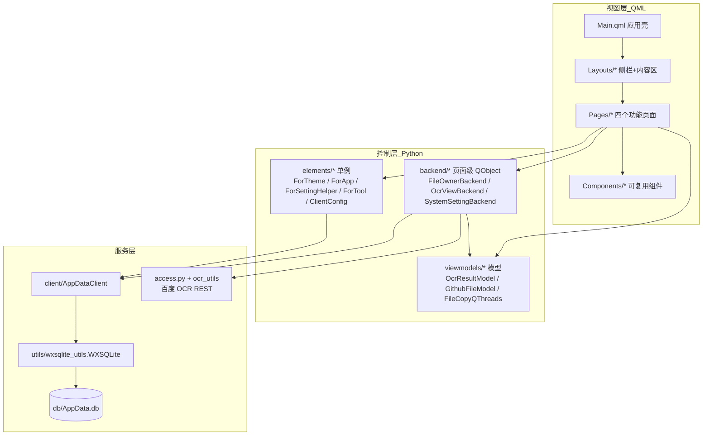
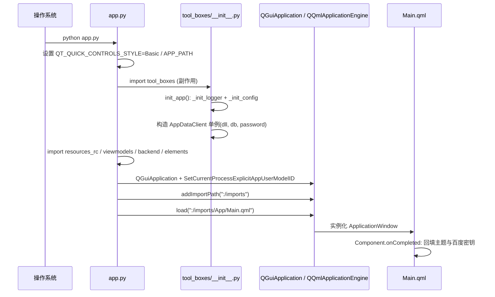

# 01 · 项目概览与整体架构

> 本章回答“这个项目是什么、怎么组织、怎么启动、各层如何协作”。是理解后续各章的总纲。

---

## 1. 项目定位

`tool-boxes`（工具箱）是一个**面向个人开发者的 Windows 桌面工具集合应用**。它以单一主窗口 + 左侧栏导航的方式承载多个相互独立的小工具，避免为每个小需求单独安装一个软件。

当前内置的工具有：

| 工具 | 页面 | 状态 |
|---|---|---|
| **OCR 图片识别**（核心） | `Pages/OcrView` | 已实现，调用百度手写识别 |
| **文件复制** | `Pages/FileOwner` | 已实现（两阶段扫描 + 复制） |
| **系统设置** | `Pages/SystemSetting` | 已实现（主题 + 百度密钥） |
| **GitHub 工具** | `Pages/GithubTool` | 原型/占位，侧栏页签被注释 |

技术基调：**Python 负责业务逻辑与系统集成，QML 负责声明式界面**，二者通过 PySide6 的 QML 类型注册机制桥接。

---

## 2. 目录结构总览

```
tool-boxes/
├── app.py                     # 程序入口：环境变量、QML 引擎、加载 Main.qml
├── app.spec                   # PyInstaller 打包规格
├── build_resources.py         # 动态生成 .qrc 并调用 pyside6-rcc
├── upx_compress.bat           # UPX 压缩 + 清理未用 Controls 样式
├── env.yml                    # 运行时配置（app_name/version/log_level）
├── requirements.txt           # 依赖（UTF-16 编码）
├── db/
│   └── AppData.db             # SQLite 配置库（当前明文）
├── tests/
│   ├── db_test.py             # SQLite 冒烟测试
│   └── hot_test.py            # QML 热重载脚手架
└── tool_boxes/
    ├── __init__.py            # 包初始化：日志 + 配置 + AppDataClient 单例
    ├── access.py              # 百度 OAuth access_token
    ├── configs.py             # 配置子系统（getpath / ConfigDict / ImportResolver）
    ├── logs.py                # 彩色控制台日志格式
    ├── backend/               # 页面级后端 QObject（QML 直接对话层）
    ├── viewmodels/            # 列表/树模型 + 工作线程
    ├── elements/              # QML 单例（主题/设置/工具/常量）+ 热重载
    ├── client/                # AppDataClient（DB 访问）
    ├── handler/               # 事件总线 EventBus
    ├── model/                 # dataclass 领域模型
    ├── utils/                 # 工具函数 + sqlite3x64.dll
    └── App/
        ├── imports/           # 全部 QML 源码（App 模块）
        ├── resources.qrc      # Qt 资源清单
        └── resources_rc.py    # rcc 编译产物
```

---

## 3. 分层架构

应用逻辑清晰地分为三层。QML 视图只与 Python 控制层交互；控制层再调用服务层（数据库、网络、工作线程）。



**命名约定**：项目采用类 MVVM 的组织方式——`backend`（编排者，QML 直接对话）、`viewmodels`（列表/树模型与工作线程）、`model`（数据对象）、`client`（数据访问）、`elements`（跨页单例）。需要说明的是，这一分层是“约定俗成”而非强制框架：QML 直接实例化 `backend` 与 `viewmodels` 中的类型，ViewModel 层整体使用率较低（详见 06 章审查）。

---

## 4. Python ↔ QML 桥接机制

这是整个项目的**核心设计**，理解它才能看懂其余代码。

### 4.1 类型注册：导入即注册

PySide6 通过模块级常量 + 装饰器把 Python 类注册进 QML 类型系统。**注册发生在模块被 import 的瞬间**（副作用），没有中心化的注册表。

`app.py` 中三行 `import *` 的唯一目的就是触发这些副作用：

```python
# app.py
from tool_boxes.viewmodels import *   # 注册 Models.* 模型
from tool_boxes.backend import *      # 注册 Backend.* 后端
from tool_boxes.elements import *     # 注册 App.Tools / App.Defs 单例
```

每个被导入的模块都声明自己的 QML 模块 URI 与版本：

```python
QML_IMPORT_NAME = "Backend.OcrViewBackend"   # QML 里的 import 路径
QML_IMPORT_MAJOR_VERSION = 1
```

### 4.2 三种暴露方式

| 装饰器 | 用途 | QML 侧用法 |
|---|---|---|
| `@QmlElement` | 可实例化类型（后端/模型） | `OcrViewBackend { id: backend }` |
| `@QmlNamedElement("X") + @QmlSingleton` | 全局单例 | 直接写 `ForTheme.backgroundColor` |
| `@Property(t, notify=…)` / `@Slot(…)` / `Signal(…)` | 属性 / 方法 / 信号 | 数据绑定 / 调用 / `Connections` |

典型示例（`elements/ForApp.py`）：

```python
@QmlNamedElement("ForApp")
@QmlSingleton
class ForApp(QObject):
    apiKeyChanged = Signal(str)

    @Property(str, notify=apiKeyChanged)
    def bdApiKey(self): ...

    @bdApiKey.setter
    def bdApiKey(self, v): ...
```

### 4.3 跨语言数据流：以 JSON 字符串为主

由于没有自动的“DB → QML 属性”绑定，**跨边界的数据统一用 JSON 字符串传递**：
- Python 侧用 `QResult.to_json()` / `json.dumps(...)` 序列化；
- 信号类型常用 `Signal('QVariant')` 承载任意 JSON；
- QML 侧 `JSON.parse(...)` 后消费。

这条约定贯穿 OCR 结果、设置读写等几乎所有跨层交互。

---

## 5. 启动流程



关键点：
1. `app.py` 先设置 `APP_PATH`（后续 `getpath()` 依赖它）。
2. `import tool_boxes` 触发 `init_app()`：初始化日志、加载 `env.yml`、构造 `AppDataClient` 单例。
3. 三条 `import *` 完成 QML 类型注册。
4. 引擎加载编译进资源的 `:/imports/App/Main.qml`（资源见 `resources.qrc`）。
5. `Main.qml` 在 `Component.onCompleted` 中通过 `ForSettingHelper.value(ClientConfig.*)` 回填主题模式与百度 API 密钥。

---

## 6. 资源路径惯用法：`getpath()`

`configs.py` 提供的 `getpath(path, raise_error=True, create_if_missing=False)` 是全项目统一的资源定位入口，兼容开发与打包两种环境：

- **绝对路径**：直接返回。
- **相对路径**：
  - 打包环境（`sys.frozen`）：基于 `sys._MEIPASS` 或 `sys.executable` 所在目录；
  - 开发环境：基于 `APP_PATH` 环境变量（`app.py` 设置）。
- `raise_error` / `create_if_missing` 控制缺失时的行为。

所有运行时资源（`sqlite3x64.dll`、`db/AppData.db`、`env.yml`）都通过它解析，保证开发态与冻结包行为一致。

---

## 7. 配置子系统（`configs.py`）

一套轻量但完整的配置框架：

- **`ConfigDict(UserDict)`**：增强字典，提供线程安全的 `merge(override, none_mode)`（`ignore/delete/override` 三种 None 处理策略）与 `getprop("a.b.c", default)` 点路径取值。
- **`ConfigEnvironment`（单例 `ENV`）**：`merge_source(resource)` 合并配置源，并自动提取 `config.imports` 交给导入解析器。
- **资源/解析器抽象**：`ConfigDataResource` / `ConfigDataLocationResolver`；已注册 `file:`（本地 YAML）与 `http:`（远程 YAML）两种协议。
- **`ImportResolver`**：维护 `protocol → resolver` 注册表与 `cached_imports` 缓存，通过事件总线触发延迟解析。

`env.yml` 当前仅声明：

```yaml
sys:
  app_name: ocr_app
  version: 1.0.0
  log_level: INFO
```

> ⚠️ 代码读取的是 `log.level`，而文件键名为 `sys.log_level`，二者不匹配，故文件中的日志级别**当前并不生效**（详见 06 章）。

---

## 8. 事件总线（`handler/_event_handler.py`）

独立于 Qt 信号的进程内发布/订阅机制：

- `Event`：携带 `source`/`tags`/`timestamp` 的事件基类。
- `EventBus`：按 `Type[Event]` 维护订阅者列表；`@subscribe(event_type, condition, priority, async_, once)` 装饰器注册；`emit(event)` 支持**事件子类派发**、按优先级降序执行、可选异步线程派发、异常隔离与一次性订阅清理。
- `EventBusInstance`：线程安全单例。

当前主要服务于配置导入解析（`RegisterResolverEvent`、`ConfigUpdateEvent`），是一套可复用的通用解耦设施。

---

## 9. 线程模型概述

项目对耗时任务统一采用**显式 `QThread` 子类**（而非 `QThreadPool`/`QRunnable`）：

- OCR 识别 → `OcrHandler(QThread)`（见 02 章）。
- 文件复制 → `SourceFolderScanner` + `FileCopyThread`（见 02 章）。

工作线程通过**信号**把进度/结果回传主线程；Qt 的队列连接（queued connection）保证跨线程安全。取消采用**协作式布尔标志**，在循环中逐次检查。

---

## 10. 本章小结

- **架构**：QML 视图 → Python 控制层（backend/单例/模型）→ 服务层（SQLite/OCR/线程）。
- **桥接**：`@QmlElement`/`@QmlSingleton` + “导入即注册”，跨层用 JSON 字符串。
- **基础设施**：`getpath()` 统一资源路径，`configs.py` 管理配置，`EventBus` 解耦事件，显式 `QThread` 处理耗时任务。

下一章进入四大功能模块的具体实现：[02 核心功能模块详解](./02-核心功能模块详解.md)。
