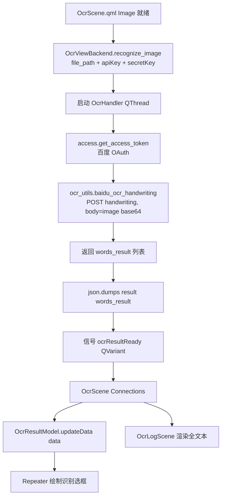
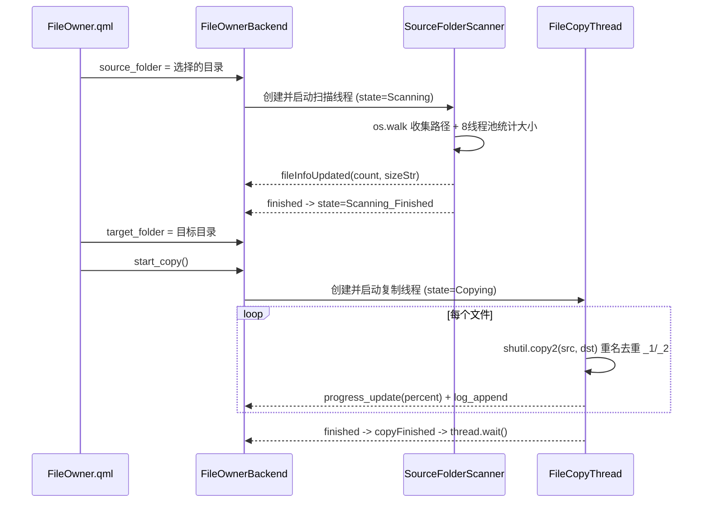

# 02 · 核心功能模块详解

> 本章按功能逐一拆解：用途、涉及文件、数据流、关键类/方法、线程与状态机。共四个功能——OCR 识别（核心）、文件复制、GitHub 工具（原型）、系统设置。

## 功能总览

| 功能 | 入口页面 | 后端 / 模型 | 上线状态 |
|---|---|---|---|
| OCR 图片识别 | `Pages/OcrView` | `OcrViewBackend` + `OcrResultModel` | ✅ 已实现 |
| 文件复制 | `Pages/FileOwner` | `FileOwnerBackend` + `FileCopyQThreads` | ✅ 已实现 |
| GitHub 工具 | `Pages/GithubTool` | `GithubFileModel` | ⚠️ 原型/占位 |
| 系统设置 | `Pages/SystemSetting` | `SystemSettingBackend` | ✅ 已实现 |

---

## 1. OCR 图片识别（核心功能）

### 1.1 用途

让用户打开/粘贴/拖入一张图片，调用**百度智能云手写文字识别**（`handwriting` 端点），在图上叠加可交互的识别选框，并将识别文本展示与复制。

### 1.2 涉及文件

| 角色 | 文件 |
|---|---|
| 页面容器 | `Pages/OcrView/OcrView.qml` |
| 图像视口 + 选框 | `Pages/OcrView/OcrScene.qml` |
| 识别/复制文本面板 | `Pages/OcrView/OcrLogScene.qml` |
| 后端 | `backend/OcrViewBackend.py`（含内嵌 `OcrHandler`） |
| 结果列表模型 | `viewmodels/OcrResultModel.py` |
| 百度 token | `access.py::get_access_token` |
| 识别/旋转 | `utils/ocr_utils.py::baidu_ocr_handwriting` / `fix_orientation` |
| 密钥持有 | `elements/ForApp.py`（`bdApiKey`/`bdSecretKey`） |

### 1.3 数据流

- `OcrScene` 中 `Image.onStatusChanged === Ready` 时调用 `backend.recognize_image(path, ForApp.bdApiKey, ForApp.bdSecretKey)`。
- `OcrHandler.run()`：`baidu_ocr_handwriting(file_path, access.get_access_token(...))`，取 `result['words_result']` 序列化为 JSON 后经 `ocr_result_ready` 信号回传；异常时回传 `None`。
- 百度返回的 `words_result[]` 中每项含 `words`（文本）与 `location`（`left/top/width/height`）。

### 1.4 图像交互（`OcrScene.qml`）

- **缩放**：`WheelHandler` + Ctrl 滚轮，夹在 `0.1–5.0`；`DragHandler` 平移。
- **载入**：右键菜单「选择图片」`FileDialog`、`DropArea` 拖入、`backend.paste_image()` 读剪贴板。
- **右键菜单项**：选择图片 / 粘贴图片 / 修正方向 / 隐藏｜显示选框 / 复原图片 / 清除图片。
- **修正方向**：`backend.fix_orientation` → `ocr_utils.fix_orientation`（Pillow `rotate(90, expand=True)`）→ 回存临时文件并重新显示。
- **选框层**：`ocrLayer` 镜像图像几何与缩放，`Repeater` 遍历 `ocrModel.model` 绘制绿色边框 `Rectangle`；`HoverHandler` 悬停变红；**双击**调用 `backend.copy_text(model.words)` 复制。

### 1.5 文本面板（`OcrLogScene.qml`）

横向 `SplitView` 两栏：
- 「📝 OCR 识别结果」`TextEdit ocrText`：`onOcrResultReady` 解析 JSON，`words` 用换行拼接。
- 「📋 复制结果」`TextEdit copyText`：`onCopySuccess` 追加已复制文本。
- 每栏右键 `FMenu` 提供「复制全部」（`ForTool.clipText`）。

> `Components/OcrBox.qml` 是一份独立的识别框组件，但当前场景用的是内联 `Repeater`，未引用该组件（见 06 章）。

---

## 2. 文件复制（FileOwner）

### 2.1 用途与命名说明

把一个源文件夹内的文件复制到目标文件夹。
> ⚠️ **命名误导**：尽管名为 “FileOwner”，该功能**并不保留 NTFS 属主/ACL**；它使用 `shutil.copy2` 保留**时间戳与基本权限**，并将所有文件**平铺**复制到目标目录（不重建目录结构）。

### 2.2 涉及文件

| 角色 | 文件 |
|---|---|
| 后端（状态机） | `backend/FileOwnerBackend.py`（含 `CopyStateType`） |
| 工作线程 | `viewmodels/FileCopyQThreads.py`（`SourceFolderScanner`/`FileCopyThread`） |
| 页面 | `Pages/FileOwner/FileOwner.qml` |
| 大小格式化 | `utils/strutils.py::human_readable_size` |

### 2.3 两阶段线程模型

- **扫描**：`SourceFolderScanner` 用 `os.walk` 收集路径，再用 `ThreadPoolExecutor(max_workers=8)` 统计总大小，每 5000 个文件打一条日志，最终 `fileInfoUpdated(数量, 可读大小)`。
- **复制**：`FileCopyThread` 逐文件 `shutil.copy2`；目标重名时追加 `_1`、`_2`；每文件发出进度百分比并 `sleep(0.002)` 让出；结束时发 `100.0`。
- **取消**：协作式标志 `_is_running`，`stop_copy()` 置位，循环内检测后发「复制已取消」。

### 2.4 状态机 `CopyStateType.CopyState`

| 值 | 含义 |
|---|---|
| `Idle = 0` | 空闲 |
| `Scanning = 1` | 正在扫描源目录 |
| `Scanning_Finished = 2` | 扫描完成（可开始复制） |
| `Copying = 3` | 正在复制 |

`FileOwner.qml` 依据该状态控制「开始复制」按钮可用性（需 `Scanning_Finished` 且已选目标）。

---

## 3. GitHub 工具（原型/占位）

### 3.1 现状

- **无任何 GitHub API 调用**，也没有 `requests` 网络请求；目前是静态原型。
- 「加载仓库」按钮的 `onClicked` 处理已被注释。

### 3.2 涉及文件

| 角色 | 文件 |
|---|---|
| 页面 | `Pages/GithubTool/GithubTool.qml` |
| 树模型 | `viewmodels/GithubFileModel.py`（`QAbstractItemModel` + `TreeItem`） |
| 表格/树视图 | `Components/Table/ForTreeView.qml` + `ForTableColumn.qml` |

### 3.3 实现要点

- `GithubFileModel` 是一个通用树模型：通过 `key`（唯一节点字段，页面里取 `"id"`）与每个节点的 `pid`（父节点 id，`0` 或未知为根）从**扁平列表建树**；`headers` 属性驱动列；`name` 列可编辑。
- `GithubTool.qml` 在 `Component.onCompleted` 用**硬编码示例 `nodes`** 填充（Projects / Project A / Task A1…）。
- 预留插槽：`update_node` / `add_node` / `remove_node`。

> 该模块是“通用树模型 + 占位页面”，未来接入 GitHub API 时可直接复用模型层。

---

## 4. 系统设置

### 4.1 用途

切换主题、配置百度 OCR 的 API_KEY / SECRET_KEY，并把设置持久化到数据库。

### 4.2 涉及文件

| 角色 | 文件 |
|---|---|
| 页面 | `Pages/SystemSetting/SystemSetting.qml` |
| 后端 | `backend/SystemSettingBackend.py` |
| 设置桥 | `elements/ForSettingHelper.py`（QSettings 子类 → 走 DB） |
| 配置键 | `elements/Defs.py::ClientConfig` |
| 主题 | `elements/ForTheme.py` |

### 4.3 行为

- **主题**：自定义 `ComboBox`（`["浅色","深色","跟随系统"]`）→ `ForTheme.themeMode = currentIndex` → `update_setting(ClientConfig.THEME_MODE, ...)`。
- **密钥**：两个 `EditInput`（密码回显），绑定 `ForApp.bdApiKey`/`bdSecretKey`，`onSave` 时持久化。
- **持久化**：`update_setting(key, value)` → `systemSettingBackend.save_setting`（返回 `QResult` JSON）→ 再经 `ForSettingHelper.setValue` 写库；启动时 `Component.onCompleted` 调 `load_settings()` 回填。
- **配置键**：`ClientConfig.THEME_MODE` / `BD_API_KEY` / `BD_SECRET_KEY`（见 [04 章](./04-数据持久化与配置系统.md)）。

> ⚠️ “跟随系统”当前并不真正跟随系统主题，详见 [06 章](./06-代码审查发现与改进建议.md) 的主题索引映射问题。

---

## 本章小结

- **OCR** 是主干功能，数据流贯穿 QML → 后端线程 → 百度 REST → 列表模型 → 选框/文本。
- **文件复制**用两阶段 `QThread` + 状态机，协作式取消。
- **GitHub 工具**是可复用树模型上的占位原型，尚未接入 API。
- **系统设置**统一管理主题与密钥并落库。

下一章看这些功能如何落到界面与组件：[03 UI 布局与 QML 组件](./03-UI布局与QML组件.md)。
