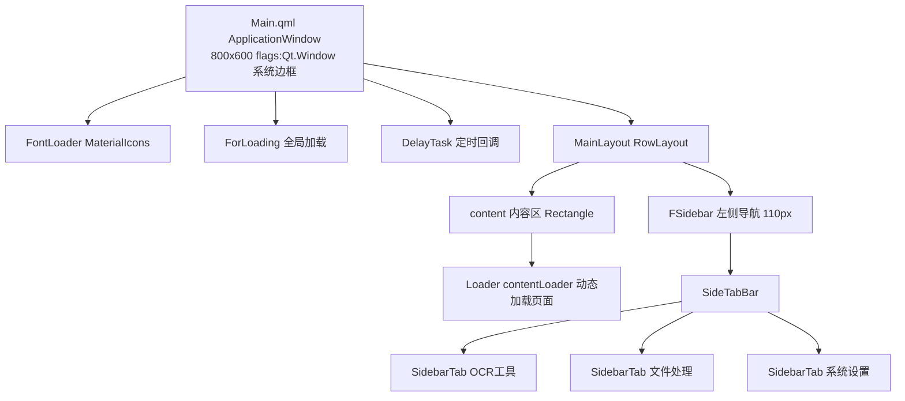
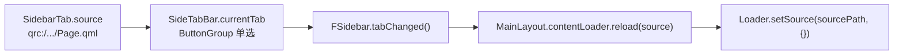

# 03 · UI 布局与 QML 组件

> 本章拆解界面：主窗口组件树、导航模型、四个页面布局、可复用组件清单、主题系统与图标。

## 1. QML 模块组织

所有 QML 源码位于 `tool_boxes/App/imports/`，编译进 `resources.qrc` 后以 `qrc:/imports/...` 访问。模块划分为：`App`（根）、`App.Components`、`App.Layouts`、`App.Pages`、`App.Tools`（Python 单例）、`App.Defs`（Python 常量）。

单例有两类：
- **纯 QML 单例**（`qmldir` + `pragma Singleton`）：`AppStore`、`Colors`。
- **Python 单例**（`@QmlSingleton`，见 [01 章](./01-项目概览与整体架构.md)）：`ForTheme`、`ForApp`、`ForSettingHelper`、`ForTool`、`ClientConfig`、`FileWatcher`。

## 2. 主窗口组件树

- `Main.qml`：`ApplicationWindow`，`flags: Qt.Window`（**使用系统标题栏，非无边框**），`title "工具箱"`，`800×600`，`color: Colors.background`。
- `MainLayout.qml`：`RowLayout`，左侧 `FSidebar`（`preferredWidth: 110`，`dragWindow: root`），右侧内容区 `Rectangle`（`radius 5`、`border` 描边、内嵌 `Loader`）。
- 顶部 `menuBar: FMenuBar` 整段**被注释**（见 §6 窗口装饰）。

## 3. 导航模型：Loader 动态加载（无栈）

切换页签通过 `Loader.setSource()` 重新加载，**没有返回栈/历史**。

- 每个 `SidebarTab` 声明一个 `source:` 指向页面 QML。
- `SideTabBar` 继承 `Container`，用 `ButtonGroup` 保证单选；`onCheckedButtonChanged` 更新 `currentTab` 并发 `tabChanged()`。
- 已上线页签（`FSidebar.qml`）：**OCR 工具**（默认选中）、**文件处理**、**系统设置**；**GitHub 工具** 页签整段被注释。

> `AppStore.qml` 是一个示例状态仓库（`pragma Singleton`），但**未被任何页面引用**，真实全局状态在 Python 单例中。

## 4. 页面布局逐一说明

### 4.1 FileOwner（文件复制）
`ColumnLayout` 自上而下：
1. 源文件夹行：`ForText` 标签 + `FileInput(folderMode: true)` → 写 `backend.source_folder`。
2. 目标文件夹行：同上 → 写 `backend.target_folder`。
3. 按钮行：`开始复制`（受 `CopyState` 与目标约束）/`停止复制`/`重置`。
4. 统计行：文件数、总大小、进度三个 `Label`。
5. `ProgressBar`（自定义样式，不确定态滚动动画）。
6. `ListView` 日志（`logModel`）。
`Connections` 绑定后端 `progressUpdated/logAppended/fileInfoUpdated/copyFinished`。

### 4.2 GithubTool（GitHub，占位）
标题栏 `📋 GitHub资源地址` → 输入行（`ForInput githubUrl` + `ForButton 加载仓库`，点击已注释）→ `ForTreeView`（`showRowSeparator: true`，三列：名称/类型/大小），模型 `GithubFileModel { key:"id" }`，`Component.onCompleted` 填充示例树。

### 4.3 OcrView（OCR）
垂直 `SplitView`：
- 上：`OcrScene`（图像视口 + 选框，`SplitView.fillHeight`）。
- 下：`OcrLogScene`（识别/复制文本，`preferredHeight 200`，min 100 / max 600）。
`OcrScene.onOcrReady` 控制日志面板可见性。详见 [02 章](./02-核心功能模块详解.md)。

### 4.4 SystemSetting（系统设置）
`ColumnLayout` 三行：主题 `ComboBox`、百度 API_KEY `EditInput`、百度 SECRET_KEY `EditInput`。`Component.onCompleted` 调 `load_settings()` 回填。

## 5. 可复用组件清单

| 组件 | 用途 | 使用位置 | 状态 |
|---|---|---|---|
| `ForButton` | 主题化胶囊按钮 | 各页面 | ✅ 使用中 |
| `ForInput` | 主题化输入框 | GithubTool | ✅ |
| `ForText` | 主题化文本标签 | FileOwner 等 | ✅ |
| `FileInput` | 文件/文件夹选择（`folderMode`） | FileOwner | ✅ |
| `EditInput` | 行内编辑（双击进入，图标切换编辑/保存） | SystemSetting | ✅ |
| `SideTabBar` / `SidebarTab` | 垂直页签栏 | FSidebar | ✅ |
| `Table/ForTreeView` | 自绘表头 + Qt TreeView | GithubTool | ✅ |
| `Table/ForTableColumn` | 列描述对象 | GithubTool | ✅ |
| `Message/Message` | 单条 toast（成功/警告/错误/信息） | 全局 | ✅ |
| `Message/MessageLoader` | 单例，把 toast 挂到 rootWindow | Main | ✅ |
| `Message/MessageManager` | toast 栈（`ListModel`，上限 5） | 全局 | ✅ |
| `Loading/ForLoading` | 模态加载遮罩 | Main | ✅ |
| `Loading/ForProgressRing` | Canvas 旋转进度环 | ForLoading | ✅ |
| `ForShadow` | 多层堆叠阴影 | Message | ✅ |
| `DelayTask` | `delay(callback, ms)` 定时回调 | Main | ✅ |
| `ColorPicker` | 颜色选择（`ColorDialog`） | — | ⚪ 已注册未使用 |
| `Dropdown` | 按钮式下拉 `Menu` | — | ⚪ 已注册未使用 |
| `ShadowBox` | 伪阴影 + 白底容器 | — | ⚪ 已注册未使用 |
| `OcrBox` | 独立识别框 | — | 🔴 未注册（孤儿） |
| `IconText` | 字体图标文本（FontAwesome） | — | 🔴 未注册（孤儿） |
| `ResizableWinHandler` | 无边框 8 向缩放 | — | ⚪ 定义未使用 |
| `WindowDragHandler` | 无边框拖动 | 仅 FMenuBar（注释中） | ⚪ 未激活 |

## 6. 窗口装饰（Chrome）

- 当前为**系统窗口**（`Qt.Window` + 系统标题栏）。
- 已存在一套完整的**自定义边框工具包但未启用**：`FMenuBar`（含 `WindowDragHandler` 拖动 + 三个 Canvas 系统按钮）、`WindowDragHandler`（`startSystemMove()`）、`ResizableWinHandler`（8 向缩放）。`Main.qml` 中 `menuBar` 被注释，故均为预留能力。

## 7. 主题系统

真实主题引擎在 **Python 侧 `ForTheme`**（`elements/ForTheme.py`），Material 3 风格、约 50 个 `QColor` 属性、每个带独立 `*Changed` 信号，QML 可直接绑定实现实时换肤。

- `themeMode`：Python `ThemeMode` IntEnum：`Light=0 / Dark=1 / High_Contrast=2 / System=3`。
- `_refresh_colors()` 重算整套调色板并发 `themeChanged`；仅实现 **Light / Dark** 两套（`themeMode==1` 为暗，其余为亮）。
- `QTimer` 每 1 秒轮询系统主题，但**仅在 `themeMode==3` 时**才响应——而 QML 主题选项是「浅色=0 / 深色=1 / 跟随系统=2」，与 Python 枚举错位，导致“跟随系统”实际落在高对比（渲染为亮色），**不生效**（见 [06 章](./06-代码审查发现与改进建议.md)）。

亮色关键色值（节选）：

| 角色 | 亮色值 | 暗色值 |
|---|---|---|
| `backgroundColor` | `#F6FAFE` | `#0F1417` |
| `surfaceContainerColor` | — | `#1C2024` |
| `primaryColor` | `#206487` | `#91CEF5` |
| `onPrimaryColor` | `#FFFFFF` | — |
| `secondaryColor` | `#4F616D` | — |
| `errorColor` | `#BA1A1A` | — |
| `outlineColor` | `#71787E` | — |

> 另有一个 **QML 静态调色板 `Colors.qml`**（`sidebarBg/background/text/accent/...`），**不随主题变化**，目前仅供 `FMenu`/`FMenuBar` 使用。项目因此存在**双主题体系并存**（`ForTheme` + `Colors`）。

## 8. 图标

- **字体图标** `MaterialIcons-Regular.ttf`（`Main.qml` 内联 `FontLoader` 加载）：编辑 `""`、保存 `""`、文件夹 `""`、文件 `""`（用于 `EditInput`/`FileInput`）。
- **位图/SVG**（`imports/icons/`）：`app.ico/png`、`arrow_icon.png`（`ForTreeView` 展开箭头）、`file.png`/`folder.png`（GithubTool 示例）、以及一组主题 SVG（`folder_closed/open.svg`、`globe.svg`、`light_bulb.svg`、`qt_logo.svg` 等，多数未被引用）。

---

## 本章小结

- **壳**：`Main.qml`（系统窗口）→ `MainLayout`（侧栏 + `Loader`）。
- **导航**：`Loader.setSource` 无栈切换，`ButtonGroup` 单选。
- **组件**：一套 `For*` 主题化组件 + Message/Loading/Table 子系统；存在少量孤儿/未用组件。
- **主题**：`ForTheme`（Python，亮/暗）为主，`Colors.qml` 为遗留静态板；“跟随系统”因枚举错位未生效。

下一章进入数据与配置：[04 数据持久化与配置系统](./04-数据持久化与配置系统.md)。
