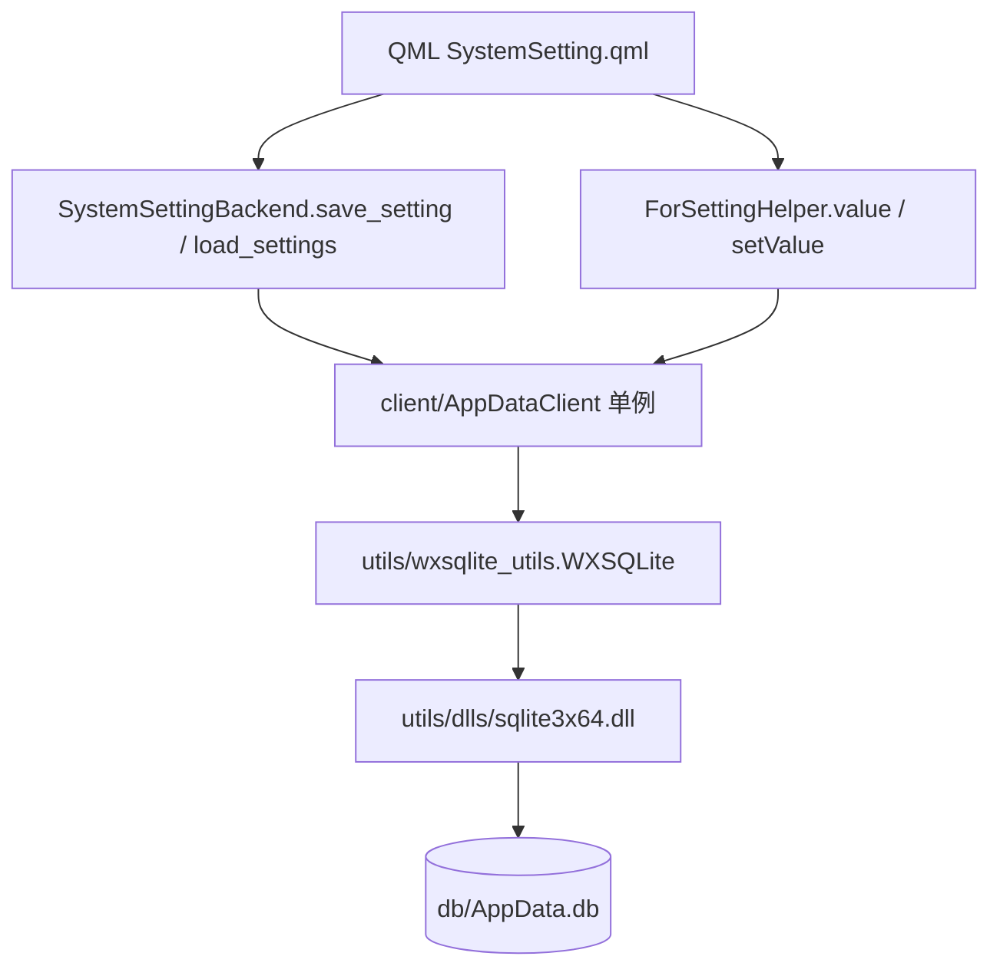

# 04 · 数据持久化与配置系统

> 本章说明应用如何存取数据：自研的 ctypes SQLite 绑定、`client_config` 表、持久化链路、配置键、`env.yml` 加载与日志。

## 1. 存储栈概览



- 数据访问统一经 `AppDataClient`（单例），底层是 `WXSQLite` 对 `sqlite3x64.dll` 的 ctypes 绑定。
- 每次操作都是**短连接**：方法内用上下文管理器新开一个 `WXSQLite`，用完即关。

## 2. SQLite 层

### 2.1 `sqlite3x64.dll`
随应用打包的 SQLite 动态库，除标准 C API 外暴露 **`sqlite3_key(db, key, len)`**——即 wxSQLite/SEE 风格的**加密入口**。

### 2.2 `WXSQLite`（`utils/wxsqlite_utils.py`）
用 ctypes 全量绑定 SQLite：
- `_setup_prototypes()` 声明 `sqlite3_open/close/key/exec/errmsg/prepare_v2/step/finalize/reset/clear_bindings/column_*/bind_*/changes` 等原型。
- `__init__` 加载 DLL、打开库、可选 `_set_key(key)`、执行 `SELECT 1` 连通性测试。
- `execute(sql)` 用 `sqlite3_exec` + 回调；查询/PRAGMA 返回 `list[dict]`，写操作返回受影响行数。
- `prepare()` / `prepare_execute(stmt, params, ...)`：预编译、按类型绑定参数、逐行解码列、`reset` 复用。

> ⚠️ **重要事实**：虽然 DLL 具备加密能力，但当前以**空密码**（`appdata.password` 缺省为空）打开，`db/AppData.db` 文件头为明文 `SQLite format 3`。**数据实际未加密**（详见 [06 章](./06-代码审查发现与改进建议.md)）。

## 3. `AppDataClient`（`client/AppDataClient.py`）

线程安全单例（`__new__` 双重检查锁）。在 `tool_boxes/__init__.py::_init_config()` 中以 `getpath(dll)`、`getpath(db)`、`ENV.getprop('appdata.password', "")` 构造。

| 方法 | 行为 |
|---|---|
| `insert_update_config(key, value)` | 先 `SELECT`，存在则 `UPDATE`，否则 `INSERT` |
| `list_configs(keys=None)` | `SELECT * FROM client_config`（`keys` 分支有缺陷，见 06 章） |
| `query_config(key)` | 按 `config_key` 查单条，返回 `ClientConfig` 或 `None` |
| `del_config(key)` | `DELETE WHERE config_key = ?` |

## 4. `client_config` 表结构

```sql
CREATE TABLE client_config (
  id            INTEGER PRIMARY KEY AUTOINCREMENT,  -- 配置唯一ID
  config_key    TEXT NOT NULL,                       -- 配置项键名
  config_value  TEXT,                                -- 配置值（可存 JSON 或字符串）
  config_type   TEXT DEFAULT 'string',               -- 类型：string/int/bool/json
  description   TEXT,                                -- 配置说明
  updated_at    DATETIME DEFAULT CURRENT_TIMESTAMP,
  created_at    DATETIME DEFAULT CURRENT_TIMESTAMP
);
CREATE INDEX idx_client_config ON client_config(config_key);
```

与 Python dataclass `model/domain/ClientConfig.py` 一一对应（`id`/`config_key`/`config_value`/`config_type`/`description`/`updated_at`/`created_at`），经 `typeutis.as_dataclass` 在行与对象间转换。

## 5. 配置键常量（`elements/Defs.py`）

`ClientConfig` 单例暴露三个 `constant` 属性，是 QML 侧引用配置键的唯一来源：

| 常量 | 值 |
|---|---|
| `ClientConfig.THEME_MODE` | `"THEME_MODE"` |
| `ClientConfig.BD_API_KEY` | `"BD_API_KEY"` |
| `ClientConfig.BD_SECRET_KEY` | `"BD_SECRET_KEY"` |

启动时 `Main.qml` 用它们回填主题与百度密钥；设置页用它们写回。

## 6. `env.yml` 与配置加载

- `env.yml`（YAML）声明 `sys.app_name/version/log_level`。
- `tool_boxes/__init__.py::_init_config()`：
  - `getpath("env.yml", raise_error=False)` 定位；打包态若 exe 旁缺失，则从包内复制到 exe 目录。
  - `ENV.merge_source(FileResolver().resolve(path))` 合并进 `ConfigEnvironment`。
  - 构造 `AppDataClient` 单例。
- 配置子系统细节（`ConfigDict`/`ImportResolver`/`file:`/`http:`）见 [01 章 §7](./01-项目概览与整体架构.md)。

## 7. 结果封装 `QResult`（`model/QResult.py`）

跨层统一返回结构：`code` / `msg` / `data`，配 `ok()` / `fail()` 工厂与 `to_json()`（经 `typeutis.asjson`，`ensure_ascii=False`，`datetime`/`set` 有自定义序列化）。`SystemSettingBackend.save_setting/load_settings` 即返回 `QResult` JSON，由 QML `JSON.parse`。

## 8. 日志

- **`logs.py::ColorConsoleFormatter`**：开发态按级别着色（DEBUG 灰、INFO 绿、WARN 黄、ERROR/CRITICAL 红），附线程名与 `filename:funcName:lineno`。
- **`tool_boxes/__init__.py::_init_logger()`**：`ConcurrentTimedRotatingFileHandler`（`when='midnight'`、`backupCount=30`、UTF-8）；打包态写 `exe 目录/logs/...`，开发态叠加彩色控制台；`logging.basicConfig(..., force=True)` 重配根日志器。

---

## 本章小结

- **存储**：ctypes 绑定加密 SQLite（`WXSQLite`），经 `AppDataClient` 单例访问 `client_config` 表；当前空密码=明文。
- **配置**：`env.yml` + `configs.py`；配置键集中在 `ClientConfig` 常量。
- **返回**：跨层统一 `QResult` JSON。
- **日志**：彩色控制台 + 按日滚动文件。

下一章看如何把这些打包分发：[05 构建、打包与开发工具链](./05-构建、打包与开发工具链.md)。
