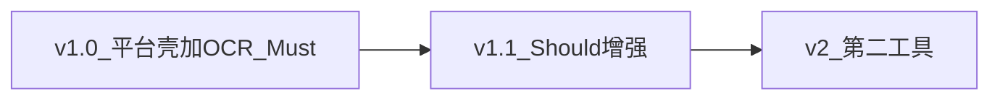
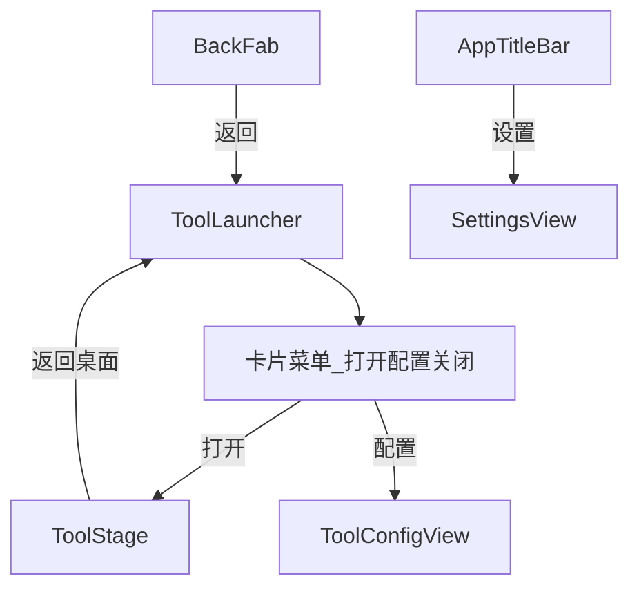

# only-mini-tool 产品设计文档

> 回答 **做什么（WHAT）**。架构硬约束见 [产品蓝图.md](./产品蓝图.md)；实现细节见 [技术实现文档.md](./技术实现文档.md)。  
> 版本：v1.0（设计基线） · 产品名：`only-mini-tool`

---

## 1. 产品概述

### 1.1 定位

**only-mini-tool** 是面向个人开发者的 **Windows 桌面工具箱平台**：统一工作台壳承载多个独立小工具。首期只交付 **OCR 图片文字识别**（百度智能云 handwriting），整壳 UI 全新设计，不复刻旧 Tool-Boxes / QML 界面。

### 1.2 一句话

> 轻量、可扩展的本地工具箱；首期用百度云端 OCR，把截图/照片里的字最快变成可复制文本。

### 1.3 核心价值

| 价值     | 说明                                                 |
| ------ | -------------------------------------------------- |
| 最快出字   | 打开/粘贴/拖入后自动识别，选框可见、一点即复制                           |
| 工作台可生长 | Tool Host 壳（Launcher 桌面 + 按目录所有权的工具模块）+ 编译期注册，后续加工具不改宿主 |
| 轻量原生   | Tauri 2 + Rust，相对旧 PyInstaller 更小更快                |
| 引擎可演进  | 多引擎（默认百度；已含 Paddle 官方 API）；后端 Registry + trait |

### 1.4 与参考材料的关系

| 来源                                 | 用途                                           |
| ---------------------------------- | -------------------------------------------- |
| 旧 Tool-Boxes（Python/QML）           | **能力对照**（三路输入、选框、自动识别等）；**UI 不迁移**           |
| `[only-tool/](./only-tool/)` 案例三文档 | **择优对照**（验收写法、引擎 trait 思路等）；**非权威、禁止照抄布局与栈** |
| only-todo / tauri-vue-desktop-arch | **工程纪律**（分层、Appearance、文档同步）                 |

---

## 2. 目标用户

| 画像     | 场景                     |
| ------ | ---------------------- |
| 个人开发者  | 从报错截图、日志图、表格图提取文字检索/粘贴 |
| 轻办公用户  | 单据/照片转可编辑文本            |
| 效率工具用户 | 希望高频小功能集中在一个轻量箱里       |

**核心诉求**：① 最快路径拿到可复制文字；② 直观看到识别位置；③ 密钥配一次即可长期用。

---

## 3. 产品分期

| 版本       | 目标           | 范围摘要                                 |
| -------- | ------------ | ------------------------------------ |
| **v1.0** | 平台壳 + OCR 闭环 | Workbench、设置、多引擎 OCR（默认百度） |
| **v1.1** | OCR / 安全增强 | 取消识别、token 缓存、复制日志、keyring、可选第二引擎 |
| **v2**   | 多工具验证扩展      | 第二工具 **Dev Codec**（`id: codec`）；验收见 §6 |

v1–v2 **不做**运行时插件市场、第三方动态加载。

---

## 4. Part A — 平台体验

### 4.1 信息架构

| 区域           | 职责                                                                 |
| ------------ | ------------------------------------------------------------------ |
| AppTitleBar  | **自定义无边框标题栏**（约 32px）：左侧标题 + 拖区；右侧系统设置 · 窗控（**无**返回） |
| BackFab      | 客户区**左上浮层**返回（对齐 OCR zoom-btn 样式；工具 / 设置 / 工具配置显示） |
| ToolLauncher | 启动默认页；网格展示已注册工具（卡片仅**图标 + 工具名**，描述悬浮 `title`）；**点击卡片弹出菜单**（打开 / 配置 / 关闭）；角标绿=运行中、红=已停止（桌面 `--status-*`，≠ OCR 选框色）；**无**页内顶栏 |
| ToolStage    | 当前工具根视图；运行中回桌面可还原现场；**关闭**后销毁会话                                   |
| 系统设置         | 特殊全屏视图；**仅**外观 + 可选调试；从标题栏齿轮进入（桌面与工具页均可）                          |
| 工具配置         | 各工具自己的全屏配置页（如 OCR 密钥）；从桌面菜单「配置」进入                                 |
| 反馈           | 全局顶部 Message（在标题栏下方）；工具 busy 留在结果面板内 |

### 4.2 平台交互规则

- 未上线工具 **不占位、不灰显**。
- 工具按目录所有权组织（`tools/<id>/`）；允许按需 import。**v1 无跨工具 bus**；工具内自管状态。
- **返回桌面 ≠ 关闭**：未关闭则可还原现场（绿点）；关闭后下次打开为干净会话（红点）。桌面状态点 ≠ OCR 选框绿/红语义。
- 桌面惯例：禁用浏览器默认右键与随意拖文件打开；自研上下文菜单与确认框。
- 主题：`system | light | dark`，与系统跟随语义正确（无枚举错位）。

### 4.3 平台验收

- 启动后默认进入 **ToolLauncher（工具桌面）**，不自动进入 OCR。
- 点击工具图标弹出菜单；「打开」进入全屏；「返回桌面」可还原；「关闭」后不再还原。
- 标题栏齿轮进**系统**设置（桌面与工具页均可）；工具密钥经菜单「配置」；非桌面页用客户区左上 **BackFab** 返回；主题持久化重启仍在。
- 窗口为自定义无边框顶栏；可拖动、缩放、最小化/最大化/关闭。
- Launcher 上 v1 仅 OCR 一张工具卡片。

### 4.4 视觉原则（全应用）

- 气质：冷静工具感；主表面留给工具内容，chrome 克制。
- 色彩：石板灰（slate）+ 青绿/青（teal–cyan）强调；避开紫靛渐变、暖奶油衬线陶土、报纸密排等常见默认脸。
- 字体：有辨识度的显示/正文配对（非 Inter/Roboto/Arial/系统默认栈）；具体字体见技术实现。
- 动效：2–3 处有意动作（切工具、空态入场、识别完成轻反馈）。
- 单一 design token 源；OCR 选框绿/红为工具语义色，不随主题改语义。

---

## 5. Part B — OCR 工具

### 5.1 工作区内 IA（全新，非旧上下 Split）

| 区域              | 职责                                          |
| --------------- | ------------------------------------------- |
| ImageCanvas     | 空态 / 图片 / 缩放平移 / 选框；拖放；**右键**操作菜单      |
| ResultInspector | 结果面板（可配**左 / 右 / 下**停靠，默认右；展开可**拖调宽/高**）；**全文 / 词条 Tab 互斥**；识别状态与失败重试 |
| 空态              | 一句话说明 +「打开图片」「粘贴」主 CTA                      |
| 右键菜单       | 打开、粘贴、显隐选框、旋转、清除、条件重试；与空态 CTA 并列主入口         |

### 5.2 能力分级

| 级别               | 能力                                                                                                                                                        |
| ---------------- | --------------------------------------------------------------------------------------------------------------------------------------------------------- |
| **Must（v1.0）**   | 文件选择、拖入、粘贴；加载成功后**自动识别**；**多 OCR 引擎（默认百度 handwriting；已含 Paddle 官方 API）**；选框叠加与 hover；选框↔结果**双向高亮**；复制单条/全文；显隐选框；顺时针旋转 90° 后重识别；清除；识别中禁重入 + busy；默认超时 **60s**；密钥在工具配置、主题在系统设置；**自定义无边框标题栏**（系统设置 / 窗控）+ 客户区 BackFab 返回；后端引擎 trait + Registry 就位 |
| **Should（v1.1）** | **取消进行中识别**（Inspector / 右键；清除亦硬取消后端）；**百度 access_token 进程内缓存**；**复制历史日志** Tab（换图/清除清空）；**keyring** 存引擎密码字段（Windows 凭据管理器；启动迁移旧 SQLite 明文） |
| **Won’t（v1）**    | 复刻旧 QML UI；多图批量；识别历史库；其它业务工具功能；运行时插件；Pinia/Router/UI kit 作为产品约束                                                                                           |

### 5.3 用户故事

| 编号    | 故事                              |
| ----- | ------------------------------- |
| US-01 | 作为开发者，我粘贴截图后自动出字，便于搜报错          |
| US-02 | 作为用户，我点击选框或结果行能互相高亮，双击/操作可复制该词  |
| US-03 | 作为用户，我拖入照片仍能看到每个字的框并复制全文        |
| US-04 | 作为用户，我在 OCR 工具配置里填写当前引擎所需字段即可长期使用 |
| US-05 | 作为用户，识别失败/超时时能看到明确原因并重试         |
| US-06 | 作为用户，深色/浅色/跟随系统下均可舒适使用          |
| US-07 | 作为维护者，我希望后续加引擎或工具时不必推翻壳与 OCR 页面 |

### 5.4 详细需求与验收

#### 5.4.1 图片输入（Must）

| 方式  | 交互                                       |
| --- | ---------------------------------------- |
| 文件  | 空态 CTA / 右键「打开」→ 系统对话框；png/jpg/jpeg/bmp/gif/webp |
| 粘贴  | 空态 CTA / 菜单或 `Ctrl+V`；优先 Web `paste` 取图片；否则 Rust 读位图或剪贴板中的图片文件路径 → 临时文件 |
| 拖放  | 拖入 Canvas；校验扩展名                          |

**验收**：三路结果一致；加载成功自动识别；换图清空上次结果（及若有的复制日志）。

#### 5.4.2 识别（Must）

- 引擎：当前活动引擎（默认百度 handwriting；可选 Paddle 官方 API）；密钥仅后端使用，不随 recognize 从 UI 传入。
- 异步：UI 不阻塞；busy 可见（画布半透明遮罩 + spinner；Inspector 状态行同步）；期间禁止再次提交识别。
- 超时：默认 60s；失败保留图片可重试。

**验收**：密钥有效时返回带位置的词条；无效密钥/断网错误可读；识别中仍可缩放平移。

#### 5.4.3 选框与结果（Must）

- 默认绿框；hover 强调（如红）；与 Inspector 列表双向高亮。
- 双击框或列表操作复制该词；支持复制全文。
- 结果面板**已展开**时，双击选框复制后切到**词条** Tab 并滚动到对应项。
- 全文与词条以 Tab **互斥**展示（默认词条）。
- 缩放/平移时选框与图不错位。

#### 5.4.4 图片操作（Must）

| 操作  | 说明                 |
| --- | ------------------ |
| 缩放  | Ctrl+滚轮，约 0.1–5.0  |
| 平移  | 拖拽 / 滚轮浏览          |
| 旋转  | 顺时针 90°，写回临时文件后重识别 |
| 显隐框 | 右键菜单开关 |
| 清除  | 清空图、结果、忙碌态（识别中亦可清除，软取消进行中写回） |

#### 5.4.5 OCR 工具配置（Must）

- 从桌面 OCR 卡片菜单「配置」进入；不出现在系统设置页。
- 引擎列表与字段由后端描述符驱动（当前：百度 handwriting / PaddleOCR 官方在线 API）；切换引擎仅改本地，保存后生效。
- 按引擎显示对应字段（密码等）；共用超时（默认 60s，适配异步识别）。
- **结果面板位置**：左 / 右 / 下（默认右）；保存后回到 OCR 工作区生效。
- 配置 schema 升级时清空旧 `ocr.*` 并恢复默认（需重新填写密钥/Token）；默认引擎为百度。

---

## 6. Part C — v2 第二工具：Dev Codec

> 用于验证 Tool Host 扩展 checklist；**未上线前不在 Launcher 占位**。

### 6.1 定位

面向个人开发者的本地文本转换工具（`id: codec`）：JSON 格式化/压缩、Base64、URL encode/decode、常用哈希。无云密钥、不依赖 OCR 状态、无跨工具 bus。

### 6.2 Must（上线时）

| 项 | 验收 |
|----|------|
| 桌面第二张卡 | 打开 / 配置 / 关闭 / 保活语义与 OCR 一致；关闭需确认 |
| 主路径 | 粘贴或输入文本 → 一键转换 → 复制结果；失败 Message 可读 |
| 工具配置 | 可选默认动作、输出是否自动复制（`codec.*`）；不进系统设置 |
| 工程 | `src/tools/codec/` + registry；纯 FE 优先，哈希/大文件再加 Rust 分层 |
| 回归 | OCR 行为零回归；不改 `open` / `deactivate` / `dispose` |

### 6.3 Won’t（v2#1）

跨工具「OCR 结果一键送入 Codec」、插件市场、批量文件夹、历史库。

---

