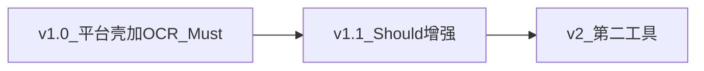
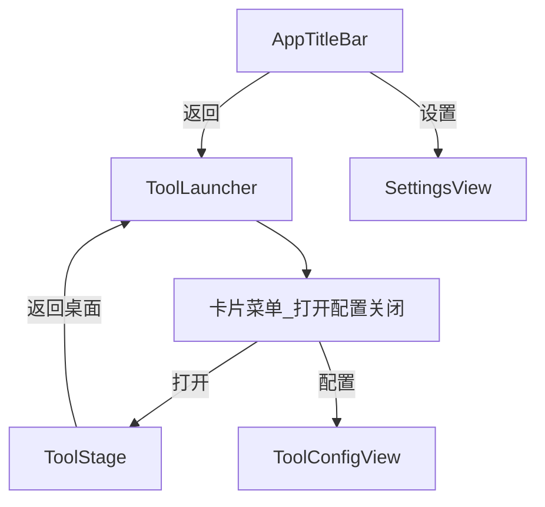

# only-mini-tool 产品设计文档

> 回答 **做什么（WHAT）**。架构硬约束见 [产品蓝图.md](./产品蓝图.md)；实现细节见 [技术实现文档.md](./技术实现文档.md)。  
> 版本：v1.0（设计基线） · 产品名：`only-mini-tool`

---

## 1. 产品概述

### 1.1 定位

**only-mini-tool** 是面向个人开发者的 **Windows 桌面工具箱平台**：统一工作台壳承载多个独立小工具。首期只交付 **OCR 图片文字识别**（百度智能云 handwriting），整壳 UI 全新设计，不复刻旧 Tool-Boxes / QML 界面。

### 1.2 一句话

> 轻量、可扩展的本地工具箱；首期用百度云端 OCR，把截图/照片里的字最快变成可复制文本。

### 1.3 核心价值

| 价值     | 说明                                                 |
| ------ | -------------------------------------------------- |
| 最快出字   | 打开/粘贴/拖入后自动识别，选框可见、一点即复制                           |
| 工作台可生长 | Tool Host 壳（Launcher 桌面 + 按目录所有权的工具模块）+ 编译期注册，后续加工具不改宿主 |
| 轻量原生   | Tauri 2 + Rust，相对旧 PyInstaller 更小更快                |
| 引擎可演进  | 多引擎（默认百度；已含 Paddle 官方 API）；后端 Registry + trait |

### 1.4 与参考材料的关系

| 来源                                 | 用途                                           |
| ---------------------------------- | -------------------------------------------- |
| 旧 Tool-Boxes（Python/QML）           | **能力对照**（三路输入、选框、自动识别等）；**UI 不迁移**           |
| `[only-tool/](./only-tool/)` 案例三文档 | **择优对照**（验收写法、引擎 trait 思路等）；**非权威、禁止照抄布局与栈** |
| only-todo / tauri-vue-desktop-arch | **工程纪律**（分层、Appearance、文档同步）                 |

---

## 2. 目标用户

| 画像     | 场景                     |
| ------ | ---------------------- |
| 个人开发者  | 从报错截图、日志图、表格图提取文字检索/粘贴 |
| 轻办公用户  | 单据/照片转可编辑文本            |
| 效率工具用户 | 希望高频小功能集中在一个轻量箱里       |

**核心诉求**：① 最快路径拿到可复制文字；② 直观看到识别位置；③ 密钥配一次即可长期用。

---

## 3. 产品分期

```mermaid
flowchart LR
    v10[v1.0_平台壳加OCR_Must]
    v11[v1.1_Should增强]
    v20[v2_第二工具]
    v10 --> v11 --> v20
```

| 版本       | 目标           | 范围摘要                                 |
| -------- | ------------ | ------------------------------------ |
| **v1.0** | 平台壳 + OCR 闭环 | Workbench、设置、多引擎 OCR（默认百度） |
| **v1.1** | OCR / 安全增强 | 取消识别、token 缓存、复制日志、keyring、可选第二引擎 |
| **v2**   | 多工具验证扩展      | 第二工具 **脚本库**（`id: scripts`）；验收见 §6；Dev Codec 延后 |

v1–v2 **不做**运行时插件市场、第三方动态加载。

---

## 4. Part A — 平台体验

### 4.1 信息架构

```mermaid
flowchart TB
    TitleBar[AppTitleBar]
    Launcher[ToolLauncher]
    Menu[卡片菜单_打开配置关闭]
    Stage[ToolStage]
    Settings[SettingsView]
    Cfg[ToolConfigView]
    TitleBar -->|设置| Settings
    TitleBar -->|返回| Launcher
    Launcher --> Menu
    Menu -->|打开| Stage
    Menu -->|配置| Cfg
    Stage -->|返回桌面| Launcher
```

| 区域           | 职责                                                                 |
| ------------ | ------------------------------------------------------------------ |
| AppTitleBar  | **自定义无边框标题栏**（约 32px）：左端**壳级返回**（非桌面视图显示）+ 拖区 + **居中标题**；右侧系统设置 · 窗控。客户区**无浮层**，100% 归工具 |
| ToolLauncher | 启动默认页；网格展示已注册工具（卡片仅**图标 + 工具名**，描述悬浮 `title`）；**点击卡片弹出菜单**（打开 / 配置 / 关闭）；角标绿=运行中、红=已停止（桌面 `--status-*`，≠ OCR 选框色）；**无**页内顶栏 |
| ToolStage    | 当前工具根视图；运行中回桌面可还原现场；**关闭**后销毁会话                                   |
| 系统设置         | 特殊全屏视图；**仅**外观 + 可选调试；从标题栏齿轮进入（桌面与工具页均可）                          |
| 工具配置         | 各工具自己的全屏配置页（如 OCR 密钥）；从桌面菜单「配置」进入                                 |
| 反馈           | 全局顶部 Message（在标题栏下方）；工具 busy 留在结果面板内 |

### 4.2 平台交互规则

- 未上线工具 **不占位、不灰显**。
- 工具按目录所有权组织（`tools/<id>/`）；允许按需 import。**v1 无跨工具 bus**；工具内自管状态。
- **返回桌面 ≠ 关闭**：未关闭则可还原现场（绿点）；关闭后下次打开为干净会话（红点）。桌面状态点 ≠ OCR 选框绿/红语义。
- 桌面惯例：禁用浏览器默认右键与随意拖文件打开；自研上下文菜单与确认框。
- 主题：`system | light | dark`，与系统跟随语义正确（无枚举错位）。

### 4.3 平台验收

- 启动后默认进入 **ToolLauncher（工具桌面）**，不自动进入 OCR。
- 点击工具图标弹出菜单；「打开」进入全屏；「返回桌面」可还原；「关闭」后不再还原。
- 标题栏齿轮进**系统**设置（桌面与工具页均可）；工具密钥经菜单「配置」；非桌面页用标题栏左端**壳级返回**；主题持久化重启仍在。
- 窗口为自定义无边框顶栏；可拖动、缩放、最小化/最大化/关闭。
- Launcher 上 v1 仅 OCR 一张工具卡片。

### 4.4 视觉原则（全应用）

- 气质：冷静工具感；主表面留给工具内容，chrome 克制。
- 色彩：石板灰（slate）+ 青绿/青（teal–cyan）强调；避开紫靛渐变、暖奶油衬线陶土、报纸密排等常见默认脸。
- 字体：有辨识度的显示/正文配对（非 Inter/Roboto/Arial/系统默认栈）；具体字体见技术实现。
- 动效：2–3 处有意动作（切工具、空态入场、识别完成轻反馈）。
- 单一 design token 源；OCR 选框绿/红为工具语义色，不随主题改语义。

---

## 5. Part B — OCR 工具

### 5.1 工作区内 IA（全新，非旧上下 Split）

| 区域              | 职责                                          |
| --------------- | ------------------------------------------- |
| ImageCanvas     | 空态 / 图片 / 缩放平移 / 选框；拖放；**右键**操作菜单      |
| ResultInspector | 结果面板（可配**左 / 右 / 下**停靠，默认右；展开可**拖调宽/高**）；**全文 / 词条 Tab 互斥**；识别状态与失败重试 |
| 空态              | 一句话说明 +「打开图片」「粘贴」主 CTA                      |
| 右键菜单       | 打开、粘贴、显隐选框、旋转、清除、条件重试；与空态 CTA 并列主入口         |

### 5.2 能力分级

| 级别               | 能力                                                                                                                                                        |
| ---------------- | --------------------------------------------------------------------------------------------------------------------------------------------------------- |
| **Must（v1.0）**   | 文件选择、拖入、粘贴；加载成功后**自动识别**；**多 OCR 引擎（默认百度 handwriting；已含 Paddle 官方 API）**；选框叠加与 hover；选框↔结果**双向高亮**；复制单条/全文；显隐选框；顺时针旋转 90° 后重识别；清除；识别中禁重入 + busy；默认超时 **60s**；密钥在工具配置、主题在系统设置；**自定义无边框标题栏**（壳级返回 / 系统设置 / 窗控，居中标题）；后端引擎 trait + Registry 就位 |
| **Should（v1.1）** | **取消进行中识别**（Inspector / 右键；清除亦硬取消后端）；**百度 access_token 进程内缓存**；**复制历史日志** Tab（换图/清除清空）；**keyring** 存引擎密码字段（Windows 凭据管理器；启动迁移旧 SQLite 明文） |
| **Won’t（v1）**    | 复刻旧 QML UI；多图批量；识别历史库；其它业务工具功能；运行时插件；Pinia/Router/UI kit 作为产品约束                                                                                           |

### 5.3 用户故事

| 编号    | 故事                              |
| ----- | ------------------------------- |
| US-01 | 作为开发者，我粘贴截图后自动出字，便于搜报错          |
| US-02 | 作为用户，我点击选框或结果行能互相高亮，双击/操作可复制该词  |
| US-03 | 作为用户，我拖入照片仍能看到每个字的框并复制全文        |
| US-04 | 作为用户，我在 OCR 工具配置里填写当前引擎所需字段即可长期使用 |
| US-05 | 作为用户，识别失败/超时时能看到明确原因并重试         |
| US-06 | 作为用户，深色/浅色/跟随系统下均可舒适使用          |
| US-07 | 作为维护者，我希望后续加引擎或工具时不必推翻壳与 OCR 页面 |

### 5.4 详细需求与验收

#### 5.4.1 图片输入（Must）

| 方式  | 交互                                       |
| --- | ---------------------------------------- |
| 文件  | 空态 CTA / 右键「打开」→ 系统对话框；png/jpg/jpeg/bmp/gif/webp |
| 粘贴  | 空态 CTA / 菜单或 `Ctrl+V`；优先 Web `paste` 取图片；否则 Rust 读位图或剪贴板中的图片文件路径 → 临时文件 |
| 拖放  | 拖入 Canvas；校验扩展名                          |

**验收**：三路结果一致；加载成功自动识别；换图清空上次结果（及若有的复制日志）。

#### 5.4.2 识别（Must）

- 引擎：当前活动引擎（默认百度 handwriting；可选 Paddle 官方 API）；密钥仅后端使用，不随 recognize 从 UI 传入。
- 异步：UI 不阻塞；busy 可见（画布半透明遮罩 + spinner；Inspector 状态行同步）；期间禁止再次提交识别。
- 超时：默认 60s；失败保留图片可重试。

**验收**：密钥有效时返回带位置的词条；无效密钥/断网错误可读；识别中仍可缩放平移。

#### 5.4.3 选框与结果（Must）

- 默认绿框；hover 强调（如红）；与 Inspector 列表双向高亮。
- 双击框或列表操作复制该词；支持复制全文。
- 结果面板**已展开**时，双击选框复制后切到**词条** Tab 并滚动到对应项。
- 全文与词条以 Tab **互斥**展示（默认词条）。
- 缩放/平移时选框与图不错位。

#### 5.4.4 图片操作（Must）

| 操作  | 说明                 |
| --- | ------------------ |
| 缩放  | Ctrl+滚轮，约 0.1–5.0  |
| 平移  | 拖拽 / 滚轮浏览          |
| 旋转  | 顺时针 90°，写回临时文件后重识别 |
| 显隐框 | 右键菜单开关 |
| 清除  | 清空图、结果、忙碌态（识别中亦可清除，软取消进行中写回） |

#### 5.4.5 OCR 工具配置（Must）

- 从桌面 OCR 卡片菜单「配置」进入；不出现在系统设置页。
- 引擎列表与字段由后端描述符驱动（当前：百度 handwriting / PaddleOCR 官方在线 API）；切换引擎仅改本地，保存后生效。
- 按引擎显示对应字段（密码等）；共用超时（默认 60s，适配异步识别）。
- **结果面板位置**：左 / 右 / 下（默认右）；保存后回到 OCR 工作区生效。
- 配置 schema 升级时清空旧 `ocr.*` 并恢复默认（需重新填写密钥/Token）；默认引擎为百度。

---

## 6. Part C — v2 第二工具：脚本库

> 用于验证 Tool Host 扩展 checklist；`id: scripts`。**Dev Codec**（原 §6）延后，不占 Launcher。

### 6.1 定位

本地 **Python 脚本库**：SQLite 存脚本正文；可配全局/单脚本 workspace 与解释器、环境变量；Monaco 编辑；表单参数；Rust 直接拉起进程。

**信任模型**：无沙盒。解释器路径、workspace、env、脚本文本均以**本机用户权限**执行；等同在本机终端运行用户自选命令。Workspace 建议填**绝对路径**；运行前会对 cwd 执行 `create_dir_all`（若不存在则创建）。

### 6.2 Must（上线时）

| 项 | 验收 |
|----|------|
| 桌面第二张卡 | 打开 / 配置 / 关闭 / 保活语义与 OCR 一致；关闭需确认 |
| 列表页 | 独立整页：新建 / 重命名 / 删除；点开进入编辑 |
| 编辑页 | 上：左元数据+参数 schema/填值+运行（左栏可拖宽）；中 Monaco（Python）；下：运行日志 panel（可拖高） |
| 返回 | 编辑页工具内「返回列表」；标题栏壳级返回仍回桌面；未保存确认（保存失败不离开） |
| 执行 | 合并 process∪全局∪脚本 env；cwd=workspace；临时 `.py` 写 app cache；可取消；硬编码超时 300s；stdout/stderr 各截断约 1MiB |
| 取消语义 | `cancel_script_run` → `ScriptRunResult.cancelled=true`（成功 Result，非错误码） |
| 工具配置 | 全局 Python 路径 / 默认 workspace / 全局 env / 参数 env 前缀 / 全局启用 venv（`scripts.*`）；不进系统设置；命名 venv 创建/列表/删除管理（显示版本号） |
| 工程 | `src/tools/scripts/` + registry；`commands`/`services`/`repository` + ts-rs |
| 回归 | OCR 行为零回归；不改 `open` / `deactivate` / `dispose` |

### 6.3 脚本作者契约（传参方式速查）

参数定义（key/类型/传参方式）在编辑页声明，运行时按 `passAs` 三通道注入，脚本按下表消费；新建脚本时可选 argparse / 环境变量 / stdin JSON / 空白四种模板（模板 body 内含同款注释速查）：

| passAs | 脚本侧写法 | 类型语义 |
|--------|-----------|----------|
| `env` | `os.environ["<PREFIX><KEY 大写>"]`（前缀全局可配默认 `PARAM_`，如 `limit` → `PARAM_LIMIT`） | 全部字符串；boolean 为 `"1"`/`"0"` |
| `arg` | argparse `add_argument("--limit", type=int)`；boolean 配 `action="store_true"`（仅 true 时传 `--key`） | argv 直传无 shell；number 由脚本 `type=` 转 |
| `stdin` | `params = json.load(sys.stdin)` | **JSON 原生类型**：整数是 `int`（非 `10.0`）、boolean 是 `bool`；无 stdin 参数时收到 `{}` |
| **`params module`（推荐）** | `from onlytool_params import params` | **免手动取参**：工具按 schema 生成 `onlytool_params.py`（frozen dataclass `Params` + 预填实例 `params`，类型映射 str/`Union[int, float]`/bool/`Literal[选项]`/`Path`），脚本同目录经 `sys.path[0]` 直达；模块名应用前缀防与用户脚本冲突；`args_template.before` 含 `-c`/`-m`/`-I` 时不可用 |

其他契约：参数 `default` 兜底在工具侧生效（表单与 API 直调一致）；key 合法字符集为 ASCII 字母数字下划线（字母/下划线开头，≤64）；运行日志面板顶部显示**等效命令**（解释器 + 参数，脚本名非临时路径，可复制）；**格式化**——Monaco Shift+Alt+F / 右键 Format Document 走后端 black；解释器链与运行**刻意不对称**：**默认 workspace `.venv` > 全局 Python**（不读脚本绑定、不受「设为默认」命名 venv 影响；无 `.venv` 则回落全局 Python）；失败 toast 可见（未装 / 损坏遮蔽分文案，指引在 workspace 行装 black）；**编码**——Python 侧 stdio 与工具统一 UTF-8（env 未设 `PYTHONIOENCODING` 时自动注入 utf-8），脚本输出非 UTF-8 时按 GB18030 回退解码，中文 print 无乱码；**venv**——多实例管理：命名 venv 创建于应用数据目录（跨 Workspace 共享、可列表/删除，删除有引用防护；列表与绑定下拉显示 Python 版本号，读 pyvenv.cfg；绑定可选 `.venv` 强制用默认工作空间环境、跳过命名默认）；**依赖安装**——命名与 workspace `.venv` 行均可「安装依赖」：包名输入 + requirements 浏览选择（杜绝相对路径歧义）二选一或并用，后端以该 venv python 绝对路径执行 `-m pip install`（600s 超时、无取消——pip 中途被杀留半装环境，重跑幂等修复；`--without-pip` 创建的 venv 自然报 No module named pip）；「在终端打开」新 cmd 窗口已激活该 venv 作逃生舱（workspace 条目同样支持；「设为默认」仅命名 venv）；workspace `.venv` 自动探测保留；**运行链 4 级**（脚本级不再可覆盖解释器路径，仅可选 venv）：脚本绑定 venv（局部，含可选 `.venv`）> 全局启用 venv（设置区「设为默认」）> 生效 workspace `.venv` > 全局 Python，指向不存在时静默回落；**异地语义**——venv 与 workspace 可异地存放：venv 解析基于自身绝对路径（`pyvenv.cfg` 的 `home` 指针），与运行 cwd 无关，workspace 内的 mise/pyenv 配置不影响已建 venv；改前缀后需同步修改脚本内读取的变量名。

### 6.4 Won’t（v2#1）

沙盒、多语言 runtime、运行历史库、定时调度、跨工具 bus、独立 Preview 模式、劫持壳级返回、Codec 同轮交付、流式日志、`scripts.timeout_ms` 设置项、argsTemplate 可视化编辑、pip list/upgrade/uninstall UI、包索引搜索、requirements 编辑器、脚本级依赖自动安装、venv 重命名。

**注意**：`args_template.before` 若含 `-c` 等解释器参数，可能使库内 `body` 不执行（高级字段，默认空）。

### 6.5 后续：Dev Codec

原文本转换工具（`id: codec`：JSON/Base64/URL/哈希）仍可作为再一工具验证；需求另立，上线前不占位。

---

