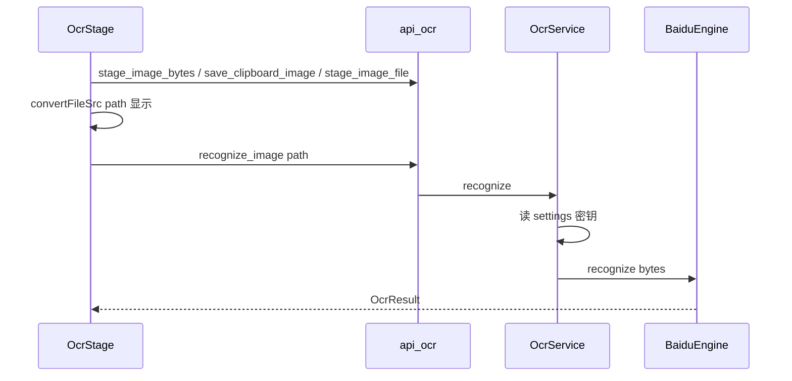

# only-mini-tool 技术实现文档

> 回答 **怎么做（HOW）**。产品行为见 [产品设计文档.md](./产品设计文档.md)；分层硬约束见 [产品蓝图.md](./产品蓝图.md)。  
> 版本：v1.0（设计基线）  
> [`only-tool/03`](./only-tool/03-技术实现文档.md) 仅作对照：吸收引擎抽象与选框算法思路，**不**采用其 Pinia/Router/Naive/plugin-store/`data-theme`/大图 IPC 字节方案。

## 实现状态

**M1 脚手架已落地**；**M1.5 Tool Host 壳**已落地；**M2 OCR 闭环已落地**；**M4 脚本库（`scripts`）已落地**。进度见 [项目进度.md](./项目进度.md)。

---

## 1. 架构概览

### 1.1 调用链

```
Vue tools/ocr + shell
  → api/ocr.ts | api/settings.ts
  → #[tauri::command]
  → services (OcrService / SettingsService)
  → domain + OcrRegistry + dyn OcrEngine
  → repository (settings)
  → infrastructure (sqlite / fs / reqwest)
  → Result<T, AppError>
```

### 1.2 运行时依赖（建议）

| 层 | 选型 | 说明 |
|----|------|------|
| 桌面 | Tauri 2 | 自定义无边框标题栏（`decorations: false`）；Windows 优先 |
| 前端 | Vue 3 + TS + Vite | Composition API；无 Pinia/Router/UI kit |
| 异步 | Tokio | command async |
| HTTP | reqwest + rustls-tls | 百度 OAuth / handwriting |
| 图像 | image crate | 旋转等 |
| 剪贴板 | arboard | 位图/文本；规避 WebView 差异 |
| DB | rusqlite + WAL | settings KV |
| 类型 | ts-rs | Domain → `src/api/generated/` |

工具链推荐 `mise.toml`（Node + Rust）；脚本：`dev` / `build` / `check` / `gen-types`。

---

## 2. Platform 实现要点

### 2.1 壳组件

| 模块 | 路径 | 职责 |
|------|------|------|
| AppShell | `shell/AppShell.vue` | AppTitleBar + home / tool / settings / toolConfig + 全局反馈 |
| AppTitleBar | `shell/AppTitleBar.vue` | 无边框顶栏：左端壳级返回（非 home 视图）、居中标题（fit-content 盒 `translateX(-50%)`，max-width `calc(100% - 260px)` 防遮挡两端按钮）、拖区、系统设置、窗控 |
| useWindowControls | `composables/useWindowControls.ts` | minimize / toggleMaximize / close / isMaximized |
| ToolLauncher | `shell/ToolLauncher.vue` | 卡片网格 → `AppContextMenu`（打开 / 配置 / 关闭）；运行态 status 点；无页内顶栏 |
| ToolStage | `shell/ToolStage.vue` | 按 session 挂载；`key=id-epoch`；KeepAlive 仅保活 |
| ToolConfigView | `shell/ToolConfigView.vue` | 动态 `registry.settingsSection` |
| AppMessageHost | `components/common/AppMessageHost.vue` | 标题栏下方堆叠 + TransitionGroup |
| AppMessage | `components/common/AppMessage.vue` | 单条 Message（色条/关钮） |
| SettingsView | `settings/SettingsView.vue` | 系统 Appearance + Debug |
| AppearanceSection | `settings/sections/` | 系统主题（`ui.*`） |
| DebugSection | `settings/sections/` | 系统调试 / 日志（`app.*`） |
| OcrSettingsSection | `tools/ocr/OcrSettingsSection.vue` | 描述符驱动引擎字段 + 超时（`get/save_ocr_settings`） |
| ScriptSettingsSection | `tools/scripts/ScriptSettingsSection.vue` | 全局 Python / workspace / env 前缀 / 全局启用 venv / 命名 venv 管理 |
| useWorkbench | `composables/useWorkbench.ts` | `mainView` 导航；调用 toolSession |
| toolSession | `platform/toolSession.ts` | `open` / `deactivate` / `dispose`；running / epoch |

设置用壳内视图枚举（`mainView: 'home' | 'tool' | 'settings' | 'toolConfig'`），**不要** Vue Router。v1 **无**跨工具 `toolBus`；工具内自管状态。

**Settings 模块所有权**（KV 仍一张 `settings` 表）：

| 归属 | 键前缀 | 前端 | Rust |
|------|--------|------|------|
| 系统 | `ui.*`、`app.*` | `settings/system/keys.ts` + sections | `domain/settings/system.rs` |
| 工具 OCR | `ocr.*` | `useOcrSettings` + bundle IPC | `domain/settings/ocr` + EngineSpec |
| 工具脚本库 | `scripts.*` | `ScriptSettingsSection` + bundle IPC | `domain/settings/scripts` |

系统 SettingsView **不**编排工具段。工具配置经 Launcher「配置」+ `ToolConfigView`。允许壳与工具按需 import；调度仍走 registry（`session` / `settingsSection` / `stage`）。

### 2.2 工具注册表

```ts
// src/tools/registry.ts — 类型见 platform/toolTypes.ts
export interface ToolDefinition {
  id: string
  labelKey: string
  descriptionKey?: string
  icon: string
  order: number
  stage: Component
  persistOnDeactivate?: boolean
  settingsSection?: Component
  session?: { dispose(): Promise<void> }
}
```

未上线工具不出现在数组中。

**会话**：`running` 为真相源（绿点）；`deactivate` 回桌面保活；`dispose` 调 `session.dispose`（OCR：`resetSession` + 临时文件 + in-flight gen）后 `epoch++`。`persistOnDeactivate === false` 时 deactivate 转 dispose。

### 2.3 Appearance

- 设置键：`ui.theme` ∈ `system | light | dark`。  
- Rust `appearance`：resolve(preference, os) → 对主窗 `set_theme`。  
- CSS：`tokens.css` 以 `html[data-scheme="light|dark"]` 驱动表面色；无 attribute 时回退 `@media (prefers-color-scheme)`。  
- 前端 `useAppearance.refresh` 写入 `document.documentElement.dataset.scheme = resolved`（仍不用 Naive / 业务 `data-theme` 体系）。

### 2.4 全局反馈

| 通道 | 用途 |
|------|------|
| Message | 操作结果与全局错误（顶中；success 短时，error 可关常驻） |
| 工具内 busy | ResultInspector 状态行（不走 Message） |

---

## 3. 持久化

### 3.1 库与迁移

- DB：`{app_data_dir}/data.db`（由 `identifier` 隔离，不再叠一层目录名）  
- 迁移：`src-tauri/migrations/*.sql`，启动按版本应用  

**表设计约定（业务表）**：

| 字段 | 说明 |
|------|------|
| `id` | `INTEGER PRIMARY KEY AUTOINCREMENT`，代理主键 |
| `created_at` | 创建时间，`TEXT`，UTC/`datetime('now')` |
| `updated_at` | 更新时间；写入时刷新 |
| 业务唯一键 | 另建 `UNIQUE`（如 `settings.key`），**不以业务键代替 id** |

例外：`schema_version` 为迁移元表，以 `version` 为主键并保留 `applied_at`。

示例（当前 `settings`）：

```sql
CREATE TABLE IF NOT EXISTS settings (
  id         INTEGER PRIMARY KEY AUTOINCREMENT NOT NULL,
  key        TEXT    NOT NULL UNIQUE,
  value      TEXT    NOT NULL,
  created_at TEXT    NOT NULL DEFAULT (datetime('now')),
  updated_at TEXT    NOT NULL DEFAULT (datetime('now'))
);
```

后续 OCR 等相关表同样遵循该约定。另：`003_scripts.sql` 业务表 `scripts`（`name` UNIQUE；`body` 正文；`workspace_path` / `interpreter_path` 可空；`env_json` / `params_schema_json` / `args_template_json`）；`004_script_venv.sql` 加列 `venv_name`（脚本级 venv 绑定，NULL = 跟随全局链）。

### 3.2 键约定

系统（`domain/settings/system` · `settings/system/keys`）：

| 键 | 含义 | 备注 |
|----|------|------|
| `ui.theme` | `system` / `light` / `dark` | Appearance |
| `ui.locale` | 如 `zh-CN` | 可选 v1 |
| `app.debug_enabled` | `true` / `false`（默认 `false`） | 调试开关；开启后可查看/清空日志、设置页按钮打开 DevTools；启动时 DEBUG 写文件 |

工具 OCR（`domain/settings/ocr` · `get_ocr_settings` / `save_ocr_settings`）：

| 键 | 含义 | 备注 |
|----|------|------|
| `ocr.settings_version` | schema 版本，当前 `2` | 不符则 wipe 全部 `ocr.*` **并清除 keyring 中引擎密码字段** + 失效百度 token 缓存，再 bootstrap |
| `ocr.active_engine` | 当前引擎 id，默认 `baidu` | Registry allowlist |
| `ocr.timeout_ms` | 超时，默认 `60000` | 全局 |
| `ocr.inspector_placement` | 结果面板停靠：`left` \| `right` \| `bottom`，默认 `right` | 经 bundle 读写；缺键 bootstrap 补默认 |
| `ocr.engine.<id>.<field>` | 引擎字段 | 仅经 `save_ocr_settings` 写入 |

Commands：`get_setting` / `set_setting` / `get_appearance`；调试：`read_app_log` / `clear_app_log` / `get_logs_dir` / `open_logs_dir` / `open_devtools`（需 `app.debug_enabled=true`）；OCR：`recognize_image(path)` / `cancel_recognize` / `get_ocr_settings` / `save_ocr_settings` / `stage_image_file` / `stage_image_bytes` / `save_clipboard_image` / `rotate_image_orientation` / `clear_ocr_temp`（**recognize 不带密钥参数**；`set_setting` 拒写 `ocr.engine.*`）；脚本库：`list_scripts` / `get_script` / `create_script` / `update_script` / `delete_script` / `rename_script` / `get_scripts_settings` / `save_scripts_settings` / `run_script` / `cancel_script_run` / `create_scripts_venv`（workspace `.venv`）/ `create_script_venv(name)`/ `format_script_code(code)`（black 格式化：轻量 spawn 不占单飞；解释器链与 Run 刻意不对称——**默认 `scripts.default_workspace` 下 `.venv` > 全局 python**（跳过 `scripts.venv` 命名默认与脚本绑定）；cwd 固定 `venvs/` 防 mise/pyenv shim；stdin 进 stdout 出，**30s** 超时；失败分 missing/broken/other 文案，指引走终端 `pip install black`；tracing 前缀 `[scripts.format]`）/ `list_script_venvs`（返回 `ScriptVenvSummary{name, pythonPath, pythonVersion, workspace}`，含 workspace `.venv` 特殊条目；pythonVersion 读 venv 根 `pyvenv.cfg` 的 `version =`，读不到为 null）/ `delete_script_venv(name)`（`".venv"` 删 workspace 条目；命名 venv 三重防护：名称白名单 `^[A-Za-z0-9_-]{1,64}$`、canonicalize 限于 `{app_data}/venvs/` 前缀、引用检查=脚本绑定 `scripts.venv_name` 或全局 `scripts.venv` 键时拒绝并列出；创建失败自动清理残留目录防同名永久失败，失败细节写 app.log）。终端：`terminal_create(payload)`（cwd/env/cols/rows/shell/init_commands/venv；shell 自动探测 pwsh→powershell→cmd 手工扫 PATH 防闪窗）/ `terminal_attach(id, on_event: Channel<TerminalEvent>) → attachId` / `terminal_detach(id, attach_id)` / `terminal_write(id, data)` / `terminal_resize(id, cols, rows)` / `terminal_dispose(id)`（幂等）/ `terminal_list` / `resolve_script_terminal(script_id)`（复用 run 的 cwd/venv 解析链，返回 ScriptTerminalConfig）。

工具脚本库（`domain/settings/scripts` · `get_scripts_settings` / `save_scripts_settings`）：

| 键 | 含义 | 备注 |
|----|------|------|
| `scripts.python_path` | 默认解释器，默认 `python` | 可绝对路径；Windows 上 mise/pyenv shim 在部分目录可能不可用，建议 `py` 或 python.exe 绝对路径；保存时于 venvs 目录探测 `--version` 可用性（mise shim 按目录解析，workspace 能跑不代表 venvs 目录能跑），不可用即拒绝保存；运行时解释器链 4 级（脚本级不可覆盖解释器，仅可选 venv）：脚本绑定 venv > 全局启用 venv（`scripts.venv` 键）> 生效 workspace `.venv`（Windows `Scripts/python.exe`、Unix `bin/python`）> 全局；命名 venv 存放 `{app_data}/venvs/<name>/`，指向不存在静默回落；`scripts.interpreter_path` 列仍在 DB（003）但已不读不写（脚本级解释器覆盖已移除） |
| `scripts.default_workspace` | 默认 cwd | 可空 → app cache 下 default-workspace |
| `scripts.env_json` | 全局 env JSON 对象 | 与脚本 env、参数投影叠加 |
| `scripts.env_prefix` | 参数 env 前缀，默认 `PARAM_` | 校验 `^[A-Za-z_][A-Za-z0-9_]{0,31}$` 非空 |
| `scripts.venv` | 全局启用的命名 venv，空 = 未启用 | 经 `set_setting` 单键写入；仅校验名称不校验存在（解析容错回落） |

执行（`services/scripts` 分工：`validate` 校验纯函数 / `prepare` 运行准备纯函数 + `TempScriptGuard` / `runner` 执行内核 / `mod` 编排 + 单飞策略）：

- **env**：`process_env ∪ global ∪ script ∪ PARAM_*`；**argv**：`args_template.before` → 脚本路径 → 动态 args → `args_template.after`（`before` 含 `-c` 等时可盖掉 body）；**stdin**：`passAs=stdin` 参数以类型化 JSON 写入子进程 stdin（number 整数优先序列化，boolean 原生 bool；无 stdin 参数写 `{}`），独立写任务避免大参数阻塞。
- 临时 `.py` 写 `{app_cache}/scripts-run/`（**不写**用户 workspace；`TempScriptGuard` Drop 删除，每次 run 前清理孤儿 `run-*.py` 兜底 app 崩溃残留）。**参数模块**：每次 run 同目录生成固定名 `onlytool_params.py`（`render_params_module`：schema → frozen dataclass `Params` + 预填实例 `params`；类型映射 str/`Union[int,float]`/bool/`Literal[选项]`/`Path`；required 无默认字段在前；值/选项 Python 字面量转义；number NaN/Inf 特判 `float("nan")`；Python 关键字 key codegen 追加 `_` 且保存校验拒绝；空 schema 生成 `pass` 空类）——脚本经 `sys.path[0]` 直接 `from onlytool_params import params`；guard Drop 与孤儿清理随脚本一并删除；`before` 含 `-c`/`-m`/`-I` 时通道失效（契约注明）。
- cwd 相对路径相对**进程 cwd**（建议绝对路径）；不存在时 `create_dir_all`。硬编码超时 **300s**（超时 kill，stderr 追加说明）。取消：`Ok(ScriptRunResult{ cancelled: true })`，无 `scripts.cancelled` 错误码。
- **执行内核（runner）**：`CancellationToken` 取消（无轮询无竞态，pre-spawn 取消直接返回空结果）；stdout/stderr 各由独立 reader 并发流式读取（防 pipe 写满死锁），`LimitedOutput` head 768KiB + tail 256KiB（VecDeque 淘汰最旧，traceback 保末尾），**超限继续读但丢弃**，内存上限恒定 ≈1MiB/流；杀树 Windows `taskkill /T /F`、Unix SIGKILL，kill 后 wait 10s 兜底、reader 汇合 5s grace + abort。
- **单飞**：`ScriptRunRegistry`（run_id → token，`std::sync::Mutex<HashMap>`）锁内原子 check+insert，策略在 service 层表达，内核无感知。
- **参数校验**：key 字符集 `^[A-Za-z_][A-Za-z0-9_]{0,63}$`（env/argv 双安全，仅保存时校验，存量不重校）；default 与类型匹配（number 可解析、select 属于选项）；运行时在 default 兜底后的有效值上校验。
- **编码**：输出解码 UTF-8 优先、非 UTF-8 回退 **GB18030**（GBK 超集；中文 Windows Python <3.15 管道默认 cp936）；env 未设 `PYTHONIOENCODING` 时自动注入 `utf-8`（大小写不敏感检查，任一层显式设置则尊重），使 Python 管道 stdio 与工具统一 UTF-8（stdin JSON 通道一致）。已知限制：混合编码流（GBK 混子进程 UTF-8 原始字节）整体按 GB18030 解码。
- `ScriptRunResult.command`：等效命令回显（解释器 + args_template + **脚本名** + 动态参数，非临时路径，仅供阅读/复制）。
- `scripts.env_json` 损坏时 `get_scripts_settings` 报 `validation_error`（不静默变空）。CSP 为 Monaco 放行 `worker-src blob:` 与 `script-src 'unsafe-eval'`（仅 editor worker）。
- **诊断 tracing 前缀**（写入 `app.log`，设置页日志面板可 grep）：`[scripts.format]`（chain=`workspace .venv`|`global python`；成功/失败 kind=missing|broken|other/超时）、`[scripts.run]`（解释器链/等效命令/结束含 exit·elapsed；绑定 `.venv` 走默认 workspace）、`[scripts.venv]`（create start/ok/failed/cleanup、pip install start/finished）。

日志文件：`{app_data_dir}/logs/app.log`（始终写入；级别 INFO，调试开启启动后为 DEBUG）。

调试入口：`app.debug_enabled=true` 时，设置页调试面板提供「打开开发者工具」按钮 → `open_devtools`。桌面守卫仍全局 `preventDefault` 禁用浏览器默认右键（不弹出调试菜单、无快捷键呼起）。Cargo 启用 `devtools` feature；运行时仍 `require_debug`。

安全说明：OCR **密码字段**存 OS keyring（`infrastructure/secret_store`，Windows Credential Manager）；读取时若库内仍有明文则迁移并清空。`ocr.settings_version` wipe 时同步 `wipe_engine_secrets_on_schema_reset`。`get_ocr_settings` 仍向配置页回传密码明文（便于编辑；不落盘）。非密钥 KV 仍明文 + OS 目录 ACL。

---

## 4. OCR 子系统

### 4.1 域模型（ts-rs 导出）

概念字段（Rust domain，serde camelCase）：

```text
OcrRect   { left, top, width, height }   // 图片像素坐标
OcrWord   { text, rect, confidence?, line? }
OcrResult { engine, words, text }
```

- `text`：便捷全文（如 `words` 换行拼接）。  
- 百度无 confidence 时归一为 `1.0`。  
- **禁止**前端另维护一套长期分叉的结果类型；以 generated 为准。

### 4.2 引擎抽象

目录：`services/ocr/{config,registry,service}.rs` + `services/ocr/engines/{baidu,paddle}.rs`。

```text
#[async_trait]
trait OcrEngine {
  fn spec(&self) -> &'static EngineSpec;  // id + fields(name/required/kind)
  async fn recognize(&self, image: &[u8], cfg: &EngineConfig) -> Result<OcrResult, AppError>;
}

EngineConfig { values: HashMap<field, String> }  // 短名；仅后端组装
OcrRegistry::global()  // OnceLock；engines::register_all()
```

**设置键（ocr.*）**：

| Key | 说明 |
|-----|------|
| `ocr.settings_version` | 当前 `2`；启动不符则 wipe `ocr.*` + keyring 密码字段 |
| `ocr.active_engine` | 默认 `baidu`；以 Registry 为准 |
| `ocr.timeout_ms` | 全局超时（默认 `60000`，适配异步引擎） |
| `ocr.inspector_placement` | `left` \| `right` \| `bottom`（默认 `right`） |
| `ocr.engine.<id>.<field>` | 如 `ocr.engine.baidu.api_key`、`ocr.engine.paddle.access_token` |

厂商 JSON **仅**在对应 `engines/<id>.rs` 解析 → `OcrResult`；Registry/Service 不做多厂商 if/else。

Baidu：OAuth → handwriting → `words_result`；**进程内** `access_token` 缓存（按 api_key/secret_key + `expires_in` 提前 120s；密钥变更或 error 110/111 失效并重试一次）。

Paddle（官方在线 API）：AI Studio Access Token；`POST/GET https://paddleocr.aistudio-app.com/api/v2/ocr/jobs` 异步提交/轮询；`done` 后 **无鉴权** 下载 `resultUrl.jsonUrl`（JSONL）→ `result.ocrResults[].prunedResult` 的 `rec_texts` / `rec_boxes`。字段：`access_token`（必填）、`model`（可选，默认 `PP-OCRv5`）。

设置 IPC：`get_ocr_settings` / `save_ocr_settings`（描述符 + 值一次往返；FE 按 field 渲染；i18n 约定 `settings.ocrEngine_${id}` / `settings.ocrField_${name}`）；密码字段经 keyring 读写。

### 4.3 Service 与 Command

| Command（示意名） | 行为 |
|-------------------|------|
| `recognize_image` | 参数：`path`；读文件 → Registry → 超时（默认 60s）→ `OcrResult`；**无** key 参数；可与 `cancel_recognize` 竞态取消 |
| `cancel_recognize` | 取消进行中识别（无任务 no-op）；释放单飞锁 |
| `get_ocr_settings` | 返回引擎列表 + 字段描述 + 当前 values（密码自 keyring） |
| `save_ocr_settings` | 写 active/timeout + **仅当前引擎**字段；密码写 keyring；校验 key 归属 |
| `rotate_image_orientation` | path + 角度 → 旋转写回/新临时文件 → 返回新 path |
| `stage_image_file` | 用户文件拷入 `app_cache_dir/ocr/` |
| `stage_image_bytes` | Web paste 等内存图片写入临时文件 |
| `save_clipboard_image` | 位图 → 临时 PNG；失败则 file_list 首个图片 staging；皆无 → `ocr.clipboard_empty` |
| `clear_ocr_temp` | 清理本工具临时文件（按策略） |
| `get_setting` / `set_setting` | KV；拒写 `ocr.engine.*` / `ocr.settings_version` |

`OcrService`：组装路径、调用引擎、映射错误码；前端 busy + 后端 `Mutex` 单飞；取消用 `AtomicBool` + `Notify` 打断 `select!`。

错误码示例：`ocr.not_configured`、`ocr.network`、`ocr.engine`、`ocr.timeout`、`ocr.bad_image`、`ocr.clipboard_empty`、`ocr.busy`、`ocr.cancelled`、`settings.*`。

### 4.4 临时文件与展示（L6/L12）


```mermaid
sequenceDiagram
    participant UI as OcrStage
    participant Api as api_ocr
    participant Svc as OcrService
    participant Eng as BaiduEngine

    UI->>Api: stage_image_bytes / save_clipboard_image / stage_image_file
    UI->>UI: convertFileSrc path 显示
    UI->>Api: recognize_image path
    Api->>Svc: recognize
    Svc->>Svc: 读 settings 密钥
    Svc->>Eng: recognize bytes
    Eng-->>UI: OcrResult
```

- 打开文件：可用用户路径或拷贝入 app temp。  
- 粘贴/旋转：写入 `%TEMP%` 或 `app_cache_dir/ocr/`。  
- 清除图片 / 退出：删除本会话临时文件。  
- **默认不**把整图 base64 作为 recognize 主 IPC。

### 4.5 前端 OCR 组件树

```
tools/ocr/OcrStage.vue
└── OcrWorkspace.vue          // placement: left|right|bottom
    ├── ImageCanvas.vue       // 右键 → AppContextMenu / useOcrActions
    └── ResultInspector.vue   // 状态 chip + 取消/重试 + 全文/词条/复制日志；随 placement 停靠/折叠
tools/ocr/useOcr.ts
tools/ocr/useOcrActions.ts
tools/ocr/session.ts
```

前端：`cancel_recognize` + `sessionGen` 丢弃写回；复制经 `copyText` 写入会话内 `copyLog`（换图/清除清空）。

**同层选框（L13）**：

- `image-stage` 上统一 `transform: scale(zoom)`（及约定 origin）。  
- `img` 与 `overlay` 同宽高（图片像素尺寸）。  
- `OcrBox`：`position:absolute; left/top/width/height = rect`；`box-sizing: border-box`。  
- 平移：视口 scroll 或平移矩阵二选一，**框与图必须同变换**。  

交互：

- 加载成功 → `recognize_image`（自动识别）。  
- busy 时禁用再次识别。  
- 框 hover / 列表 hover → 双向高亮同一 `word` 索引。  
- 双击框或列表操作 → 复制该词 + Message。  
- 画布右键：打开、粘贴、显隐框、旋转、清除、取消识别、条件重试。  
- 识别状态在 ResultInspector；busy 可取消；失败可重试。  
- 布局由 `ocr.inspector_placement` 决定（左/右/下）；全文 / 词条 / 复制日志为 Tab（默认词条）。  
- 展开时可拖贴画布边调整尺寸：左/右改宽（240–560px），底改高（≥160px、≤工作区 70%）；`localStorage` 键 `ocr.inspector.size.width` / `ocr.inspector.size.height`。  
- 双击选框 reveal：若当前非词条 Tab 则先切换，再 `scrollIntoView`。  

空态：`AppEmpty` + 打开/粘贴 CTA。

---

## 5. 共享 primitives 与视觉 token

### 5.1 primitives

**已落地**：`AppButton`、`AppEmpty`、`AppContextMenu`、`AppMessage`、`AppMessageHost`、`ToolCard`、`AppPanel`、`AppInput`、`AppConfirm`（confirm/cancel 双主钮 + 可选 `neutralLabel` 第三动作；slot 仅放表单内容，不放按钮）。

**未实现（规划）**：`AppSplit`（需要时再补；禁止用死文件占位）。

OCR Inspector **不是**全局强制壳。Launcher 关闭工具走 `AppConfirm`；Esc 关闭卡片菜单。

### 5.2 关键尺寸（建议写入 tokens）

| Token / 量 | 建议值 |
|------------|--------|
| `--header-height` | 48px（Launcher 等） |
| `--header-height-tool` | 32px（工具细顶栏） |
| `--toolbar-height` | 48px（预留；OCR 已不用整条工具栏） |
| `--launcher-icon-size` | 44px |
| `--launcher-card-min` | 100px |
| `--launcher-card-max` | 116px |
| `--inspector-width` | 320px（默认宽；运行时可拖，见 localStorage） |
| `--scrollbar-size` | 10px（全局滚动条宽/高） |
| `--scrollbar-size-thin` | 6px（窄容器变体，`data-scrollbar="thin"`） |
| `--scrollbar-thumb` / `--scrollbar-thumb-hover` | `color-mix(--text-muted 45%/75%, transparent)`（派生自 --text-muted，随 data-scheme 自动切换） |
| 强调色 | teal/cyan 系（具体 hex 实现时定，避开紫靛默认脸） |
| 选框默认/hover | 绿 / 红（工具语义，不跟主题换义） |

字体：实现时选定可商用授权的一对显示/正文（例如 IBM Plex Sans 类），写入 `tokens.css` 与 README；禁止默认 Inter/Roboto/Arial/system 栈作为品牌正文字体。

动效：切工具、空态入场、识别完成 — 各一处即可。

### 5.3 滚动条

- **方案**：全局 `::-webkit-scrollbar` 伪元素（`styles/base.css`）——WebView2 固定 Chromium 零风险；圆角胶囊细条 + 透明轨道 + thumb hover 变深只有伪元素可做。token 见 §5.2（`--scrollbar-*`，thumb 派生自 `--text-muted` 随主题切换）。
- **变体**：窄容器加 `data-scrollbar="thin"` 属性（6px）；全局属性选择器，特异性恒胜默认，新增滚动容器自动继承默认样式、无需登记。
- **页面约定**：设置页/工具配置页 `scrollbar-gutter: stable both-edges`（720px 列永久居中不跳，保「滚动条贴窗右」裁定）；设置页调试日志 pre 加 `overscroll-behavior: contain`（全项目唯一真实滚动链）；thin 用于：调试日志、脚本编辑左栏、脚本日志面板、OCR 检查器三 tab。Monaco 自绘 DOM 条不吃 CSS 伪元素，经 option 对齐（`scrollbar.verticalScrollbarSize/horizontalScrollbarSize: 10` 对齐 `--scrollbar-size`，`useShadows: false` 去投影）。
- **禁令**：全项目**永不**引入标准 `scrollbar-width` / `scrollbar-color`——Chromium 121+ 会静默覆盖伪元素方案。
- **行为说明**：自定义伪元素会禁用 WebView2 可能启用的 overlay/fluent 滚动条，强制经典占位式——这是可预测性的来源而非兼容性损失。thumb 仅颜色过渡、无运动学内容，故不设 `prefers-reduced-motion` 分支。
- **非目标**：原生 `<select>` 下拉弹层（不可样式化）。


---

## 6. 旧能力 → 新模块映射

| 旧 Tool-Boxes 概念 | 新落点 |
|--------------------|--------|
| `OcrViewBackend` + `OcrHandler` | `OcrService` + async command |
| `access.py` + `baidu_ocr_handwriting` | `BaiduEngine` |
| `fix_orientation` (Pillow) | `fix_image_orientation` + image crate |
| 剪贴板图 | Ctrl+V：`paste` DataTransfer → `stage_image_bytes` + blob 预览；按钮：仅 Rust `save_clipboard_image`（arboard PNG/DIBV5 → Win CF_DIB/BITMAP → file_list；无 WebView 权限弹窗） |
| `OcrResultModel` | `OcrResult` domain + ts-rs |
| QML 选框 Repeater | `ImageCanvas` overlay + 同层 scale |
| `ForSettingHelper` / SQLite client_config | settings KV repository |
| `ForTheme` 错位枚举 | AppearanceHost `system\|light\|dark` |
| 文字侧栏 + Loader 页 | ToolLauncher + registry + ToolSession 保活 |
| 上下 Split 结果区 | **可配置**：默认右侧停靠；亦可左/下（`ocr.inspector_placement`） |
| 密钥经 QML 传入 recognize | **废除**；Rust 读 settings |

UI 像素与 QML 组件树 **无对应迁移关系**。

---

## 6.5 终端子系统与通用编辑器模块（v0.3.0）

### 6.5.1 终端（xterm.js + ConPTY）

**硬性约束**：不弹任何系统控制台窗口、不依赖用户安装终端软件——shell 进程（pwsh/powershell/cmd，Windows 自带）无窗口挂在 ConPTY 上，由应用内 xterm.js 渲染。

**Rust（`services/terminal/`）**：`portable-pty 0.8` 打开 ConPTY；`TerminalRegistry` 全局会话表（上限 16，**不进脚本单飞**——多会话并发）；每会话 3 线程：reader（阻塞读 8KB→mpsc）→ broadcaster（`recv_timeout(8ms)` 合并窗口、单帧 ≤64KB 切分 → `Utf8Accumulator` 增量解码（跨 chunk 劈开的多字节扣留到下轮，非法序列 U+FFFD；GBK 输出为已知限制）→ scrollback 环形（256KiB 字节预算）→ Channel 广播；EOF 冲刷并发 Exit）+ waiter（记录退出码）。锁序 subscribers→scrollback，attach 快照+注册持锁（回放无间隙不重复）；Channel 发送失败自愈剪枝。dispose 复用 runner 的 `kill_tree`（taskkill /T /F）；`RunEvent::Exit → dispose_all()` 防 conhost/shell 残留。

**venv 激活（env 注入式，不执行 Activate.ps1）**：`VIRTUAL_ENV` + PATH 前插 `Scripts/` + `PYTHONUTF8=1`；编码统一与 venv 徽标提示符经**启动参数**注入（v0.3.1 起）：pwsh/powershell `-NoLogo -NoExit -EncodedCommand base64(UTF-16LE)`（Output/InputEncoding + prompt 函数，零 stdin 写入=零回显零竞态）；cmd `/k @chcp 65001>nul`；用户自定义 `init_commands` 仍走延迟写入（显式 opt-in，会回显）。终端 env 全量继承系统环境 + 追加（与 runner 的 env_clear 白名单刻意相反）。无 `deactivate` 命令（已知取舍）。

**子进程 spawn 纪律（v0.3.1 根因修复）**：GUI 父进程（`windows_subsystem="windows"`）flags=0 spawn 控制台子进程会**每次新分配 console**——高频叠加 ConPTY 资源累积后在 CSRSS/conhost 初始化阶段间歇失败（`STATUS_DLL_INIT_FAILED 0xC0000142`，实测终端会话存活期间 format 连续失败）且每次闪窗。全仓库 spawn 点（runner/format/probe/kill_tree）经 `infrastructure::process::no_window*` 统一加 `CREATE_NO_WINDOW`（stdio 全管道零语义损失）；format 补 `kill_on_drop`。

**前端 kit（`src/components/terminal/`）**：`xtermLoader`（动态 import 单例，@xterm 系独立异步 chunk ~291KB/gzip 73KB + CSS 4KB，主包零重依赖）；`TerminalView`（单会话核心：attach 回放/ResizeObserver 100ms 防抖 fit/退出覆盖层/`attachOnly` 只附着模式/智能复制粘贴——Ctrl+C 有选区复制无选区 ^C、Ctrl+V 粘贴、右键复制粘贴清屏菜单；unmount 只 detach 不销毁；字体 Cascadia Mono 栈 + `--terminal-bg` 专属底色）；`TerminalTabs`（多会话标签宿主：v-show 保挂载、「+」新建通用 shell、标签关闭即 dispose、`disposeAllTabs/releaseAllTabs` 供宿主管生命周期）；`useTerminalSessions`（key→id 登记表，in-flight 去重，**Exit 后 10s 自动回收**）。标签样式统一走 `common/AppTab.vue`。

**会话归属与回收（v0.3.1 语义）**：会话记录归属窗口 label——非 main 窗口 attach 即取得归属（`attach_owner`），`WindowEvent::Destroyed → dispose_owned_by` 自动回收（覆盖子窗 webview 异常消亡）；`RunEvent::Exit → dispose_all` 兜底。dispose = kill_tree + 立即关闭 PTY（take master/writer）——reader 必得 EOF、线程必然退出（根治孙进程幸存泄漏）。编辑页 dock 会话键含环境指纹 `script:<id>:<venv|global>:<cwd>`（挂载期间切脚本/换绑定销毁重建，同环境往返列表保留回放）；设置页会话随页面走（离开设置页销毁；拖出后 `releaseAllTabs` 移交子窗）。Exit 事件含退出码（waiter 先写 code 再置 exited，broadcaster 小窗口等待）；**Resize 事件广播采纳式同步**（接收方对齐显示尺寸不回发，防双视图折行错乱/乒乓）。

**接入点**：编辑页底栏「运行日志 | 终端」标签页（`resolve_script_terminal` 复用 run 解析链：cwd + venv 徽标）；设置页 venv 行「终端」→ 展开区 TerminalTabs（收起不销毁）。

### 6.5.2 子窗口基建

`platform/childWindow.ts`：`WebviewWindow`（同 label 聚焦；URL `new URL("?win=…", location.href)` dev/prod 一致）；`windows/`：`ChildWindowRoot`（裸根 + AppMessageHost）+ `ChildWindowTitleBar`（复用 WindowControls）+ `TerminalWindowApp`（关窗销毁名下全部会话、全标签关闭自动关窗、3s 主题轮询——无事件系统下的零基建方案）+ `EditorWindowApp`。`main.ts` 按 `?win=` 分发（共用 i18n/appearance/desktopGuards）。capabilities：`child-windows.json`（`terminal-*`/`editor-*` glob）+ default.json 追加 `core:webview:allow-create-webview-window`（只增不减）。

### 6.5.3 通用 Monaco 模块（`src/components/editor/`）

`monacoLoader`（loadMonaco 单例：editor.api+editor.all；`ensureLanguage` 语言贡献按需注册表，未登记语言告警）+ `monacoThemes`（only-light/dark + 外观跟随）+ `providers`（`registerMonacoProviders(id, …)` 幂等框架，未就绪注册告警）+ `CodeEditor`（通用 wrapper：v-model/save 契约、options 浅合并覆盖、pushEditOperations 保 undo 栈）。领域扩展示例：`tools/scripts/monacoPython.ts`（params 补全/关键字/片段/black）。产物：monaco 系列 chunk 与基线一致（同一动态导入图）。编辑器子窗口（`EditorWindowApp`）：按脚本 ID 加载/编辑/保存，**`v-if="script"` 门控挂载**（undo 栈不留空→全文步，根除一次 Ctrl+Z 清空脚本）、save sentBody 守卫（保存窗口期并发键入不丢）、dirty 关窗三分支；**跨窗同步（v0.3.1）**：主/子窗 focus/visibilitychange 时 getScript 快照比对（`useScripts.snapshotKey`，不用秒级精度的 updatedAt）——非脏静默刷新、脏三分支确认（采用远端/保留本地=基准换远端）；「拖出编辑器」不再强制保存。

### 6.5.4 依赖安装移除

`install_script_venv_packages` command / `install_venv_packages` + `pip_install_registered` service / 前端 api 与设置页 install-panel / i18n venvInstall 系列键，全链路删除（终端激活 venv 后手敲 pip 替代）。`classify_black_failure`/`ScriptRunResult` 仍被 run/format 使用，保留。

---

## 7. 构建与质量

| 场景 | 命令 |
|------|------|
| 开发 | `mise run dev` / `npm run tauri dev` |
| 类型生成 | `mise run gen-types` / `npm run gen:types` |
| 本地对齐 CI | `mise run ci`（version + `vue-tsc` + `cargo check` + gen-types drift） |
| 版本校验 | `npm run check:version` |
| 版本 bump | `npm run bump -- patch\|minor\|major`（只改文件） |
| 一键发版 | `npm run release:patch\|minor\|major`（bump + `--git-tag` + `--push`）；或 `mise run release -- patch --git-tag --push` |
| 打 tag（不 push） | `node scripts/bump-version.mjs patch --git-tag`（**勿** `npm run bump -- … --tag`，npm 会吞 `--tag`） |
| 打包 | `npm run tauri build`（NSIS/MSI） |

### CI / CD（GitHub Actions）

| Workflow | 触发 | 内容 |
|----------|------|------|
| [`.github/workflows/ci.yml`](../.github/workflows/ci.yml) | `push` / `pull_request` → `master` | Windows：`check:version`、`npm run build`、`cargo fmt --check`、`clippy -D warnings`、`cargo check`、gen-types drift |
| [`.github/workflows/release.yml`](../.github/workflows/release.yml) | tag `v*`；`workflow_dispatch` | Windows：`tauri-action` 打 NSIS/MSI，创建 **draft** GitHub Release |

Runner 固定 `windows-latest`（`keyring` / 剪贴板等 Windows 依赖）。

**发布流程**：

1. 默认分支 CI 绿  
2. `npm run release:patch`（或 minor/major）——写入版本、commit、annotated tag、push 分支与 tag  
3. Release workflow 产出 draft → 干净 Win10/11 冒烟（WebView2、OCR 设置、识别）后 publish  

后续（未做）：Authenticode 签名、Tauri updater、macOS/Linux 矩阵、七牛国内镜像。

前置：Windows 10/11、WebView2、Rust stable、Node（mise 钉版本）。

---

## 8. 建议实现顺序

1. 脚手架 + 分层空模块 + AppError + DB 迁移 + Appearance  
2. AppShell（Launcher/Stage/Settings）+ registry（v1 无跨工具 bus）  
3. settings get/set + 主题持久化  
4. OcrEngine trait + BaiduEngine + recognize_image(path)  
5. 临时文件 / 剪贴板 / 旋转  
6. ImageCanvas 同层 overlay + Inspector + Toolbar + 自动识别  
7. 错误码 i18n + Message  
8. 打包冒烟  

---

## 9. 附录：再增引擎最小步骤

1. `src-tauri/src/services/ocr/engines/<id>.rs` 实现 `OcrEngine` + `EngineSpec`  
2. `engines/mod.rs` 的 `register_all` 加一行  
3. i18n 补 `settings.ocrEngine_<id>` / 新 `settings.ocrField_*`（若有新 field name）  
4. **不改** `ImageCanvas` / `ResultInspector` 消费的 `OcrResult` 形状；**不改** FE 设置分支（描述符驱动）

第二**工具**（非引擎）走产品蓝图 §3.3 checklist。

---

*实现过程中若接口或表结构变更，须同步本文与产品设计；并写入 `项目进度.md`（实现开工时创建）。*
